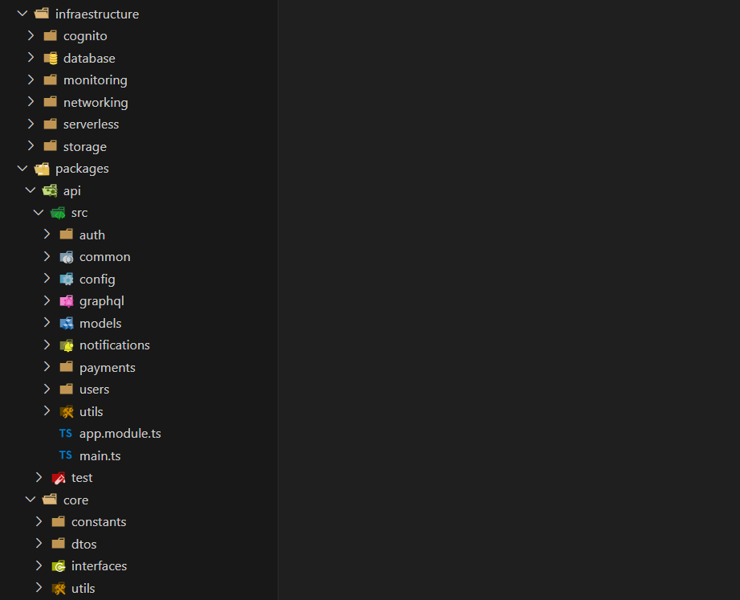
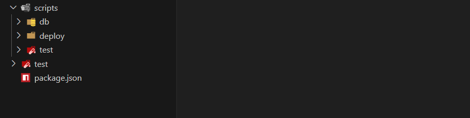
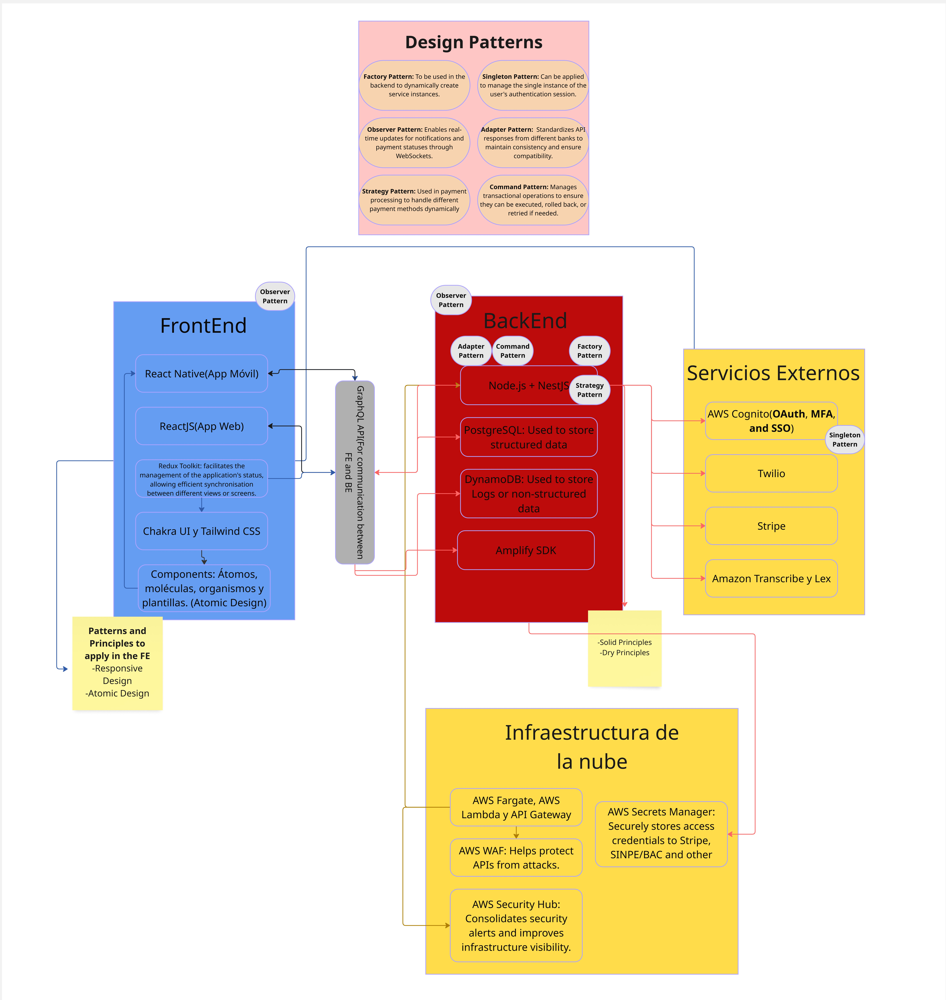

# Caso 2

# System name - Billbot
Marcelo Gomez
Isaac Rojas
Juan Carlos Valverde

## Description: 
Payment Assistant is a smart financial assistant that helps users automate and manage their recurring payments safely and easily. With voice commands, users can set up and confirm payments, ensuring they never miss a bill. The system connects with major banking APIs and offers flexible subscription plans based on transaction volume.

Key Features:
- Secure Transactions: Uses strong encryption and follows PCI DSS security standards.
- Bank Integration: Connects directly to banking APIs for seamless payments.
- Voice Command Payments: Users can manage payments hands-free with AI-powered voice recognition.
- Smart Payment Reminders: Sends real-time alerts and notifications to keep users on track.
- Scalable Infrastructure: Built to handle growth and ensure reliable performance.

## Stack: write down the final stack to be use decided for the group
- Frontend: React Native (Expo) for mobile development, ReactJS for web
- Backend: Node.js (NestJS) with GraphQL API
- Database: PostgreSQL (Amazon RDS) for structured data, DynamoDB for logs
- Cloud & Hosting: AWS Fargate, API Gateway, AWS Lambda
- Authentication: AWS Cognito (OAuth, MFA, SSO support)
- DevOps & QA: AWS CodePipeline, AWS X-Ray, AWS CloudWatch Synthetics
- Security: AWS WAF, AWS Secrets Manager, AWS Security Hub
- AI/NLP: Amazon Transcribe & Lex for voice processing
- 3rd-Party Integrations: Twilio (SMS), Stripe (Subscriptions), SINPE/BAC APIs (Banking)

## Frontend design specifications


### Authentication platform", Conduct research to determine which service platform you will use for authentication, ensuring that it offers at least:

#### Chosen platform: AWS Cognito
AWS Cognito meets all authentication requirements:

- Login and password authentication
- SDK for screen generation and API access
- Fully compatible with React Native and ReactJS
- Multi-Factor Authentication (MFA) available
- Sandbox for testing authentication flows

Implementation Steps:

- Configure Cognito User Pool and Identity Pool in AWS.
- Implement authentication flow in React Native using Amplify SDK.
- Customize UI components for login/signup screens.
- Use Postman to test MFA API calls and store results in the repository.


Repository Structure
```
/src
  ├── App.js                     # Uses Amplify Authenticator
  ├── aws-exports.js            # AWS backend config
  └── components/
        └── LoginForm.js        # Optional custom login
/docs
  └── PaymentAssistant_AuthTests.postman_collection.json
```

Code Implementation:
```
// LoginForm.js (Custom)
import React, { useState } from 'react';
import { Auth } from 'aws-amplify';

export default function LoginForm() {
  const [email, setEmail] = useState('');
  const [password, setPassword] = useState('');
  const [error, setError] = useState(null);

  const handleSignIn = async (e) => {
    e.preventDefault();
    try {
      await Auth.signIn(email, password);
      alert('Login successful');
    } catch (err) {
      setError(err.message);
    }
  };

  return (
    <div style={{ maxWidth: '400px', margin: 'auto', padding: '2rem' }}>
      <h2>Login</h2>
      <form onSubmit={handleSignIn} style={{ display: 'flex', flexDirection: 'column' }}>
        <input
          type="email"
          placeholder="Email"
          value={email}
          onChange={(e) => setEmail(e.target.value)}
          required
          style={{ marginBottom: '1rem', padding: '0.5rem' }}
        />
        <input
          type="password"
          placeholder="Password"
          value={password}
          onChange={(e) => setPassword(e.target.value)}
          required
          style={{ marginBottom: '1rem', padding: '0.5rem' }}
        />
        <button type="submit" style={{ padding: '0.5rem', backgroundColor: '#007bff', color: 'white' }}>
          Login
        </button>
        {error && <p style={{ color: 'red', marginTop: '1rem' }}>{error}</p>}
      </form>
    </div>
  );
}
```

Cognito MFA Postman Collection:

```
{
  "info": {
    "name": "AWS Cognito MFA Simulation",
    "schema": "https://schema.getpostman.com/json/collection/v2.1.0/collection.json",
    "_postman_id": "fictitious-id-1234"
  },
  "item": [
    {
      "name": "1 - InitiateAuth",
      "request": {
        "method": "POST",
        "header": [
          {
            "key": "Content-Type",
            "value": "application/x-amz-json-1.1"
          },
          {
            "key": "X-Amz-Target",
            "value": "AWSCognitoIdentityProviderService.InitiateAuth"
          }
        ],
        "body": {
          "mode": "raw",
          "raw": "{\n  \"AuthParameters\": {\n    \"USERNAME\": \"testuser@example.com\",\n    \"PASSWORD\": \"TestPassword123!\"\n  },\n  \"AuthFlow\": \"USER_PASSWORD_AUTH\",\n  \"ClientId\": \"3bt4exampleclientidfoo9vvv6\"\n}"
        },
        "url": {
          "raw": "https://cognito-idp.us-west-2.amazonaws.com/",
          "protocol": "https",
          "host": [
            "cognito-idp",
            "us-west-2",
            "amazonaws",
            "com"
          ],
          "path": [
            ""
          ]
        }
      }
    },
    {
      "name": "2 - RespondToAuthChallenge",
      "request": {
        "method": "POST",
        "header": [
          {
            "key": "Content-Type",
            "value": "application/x-amz-json-1.1"
          },
          {
            "key": "X-Amz-Target",
            "value": "AWSCognitoIdentityProviderService.RespondToAuthChallenge"
          }
        ],
        "body": {
          "mode": "raw",
          "raw": "{\n  \"ChallengeName\": \"SOFTWARE_TOKEN_MFA\",\n  \"ClientId\": \"3bt4exampleclientidfoo9vvv6\",\n  \"ChallengeResponses\": {\n    \"USERNAME\": \"testuser@example.com\",\n    \"SOFTWARE_TOKEN_MFA_CODE\": \"123456\"\n  },\n  \"Session\": \"EXAMPLESESSIONTOKEN==\"\n}"
        },
        "url": {
          "raw": "https://cognito-idp.us-west-2.amazonaws.com/",
          "protocol": "https",
          "host": [
            "cognito-idp",
            "us-west-2",
            "amazonaws",
            "com"
          ],
          "path": [
            ""
          ]
        }
      }
    },
    {
      "name": "3 - Authenticated API Request",
      "request": {
        "method": "GET",
        "header": [
          {
            "key": "Authorization",
            "value": "Bearer {{AccessToken}}"
          }
        ],
        "url": {
          "raw": "https://myapi.example.com/user/profile",
          "protocol": "https",
          "host": [
            "myapi",
            "example",
            "com"
          ],
          "path": [
            "user",
            "profile"
          ]
        }
      }
    }
  ]
}
```

InitiateAuth


Response:
```
{
  "ChallengeName": "SOFTWARE_TOKEN_MFA",
  "Session": "EXAMPLESESSIONTOKEN=="
}
```

RespondToAuthChallenge


Response:
```
{
  "ChallengeName": "SOFTWARE_TOKEN_MFA",
  "ClientId": "3bt4exampleclientidfoo9vvv6",
  "ChallengeResponses": {
    "USERNAME": "testuser@example.com",
    "SOFTWARE_TOKEN_MFA_CODE": "123456"
  },
  "Session": "EXAMPLESESSIONTOKEN=="
}
```

Autheticated API Request


#### Client Architecture

The application follows an N-layer architecture, where:

- The frontend (React Native/ReactJS) communicates with the backend via GraphQL API.
- The backend (NestJS + Node.js) serves as the business logic layer, interacting with the database and external banking APIs.
- The database (PostgreSQL + DynamoDB) stores user payment configurations and transaction logs.
- The authentication layer (Cognito) manages user sessions and authorization.
- Cloud infrastructure (AWS Fargate, API Gateway, Lambda) ensures scalability and resilience.

The mobile application is built with React Native (hybrid approach), and the web version is implemented with ReactJS using client-side rendering (CSR). The state is managed using Redux Toolkit, allowing seamless synchronization between different user interactions.

The frontend communicates with backend services via GraphQL APIs, ensuring optimized data retrieval. Transactions, authentication, and user settings are managed through secure API calls with AWS API Gateway, protecting endpoints against malicious traffic.

#### Visual Components

##### Patterns & Principles

- SOLID principles: Used in the backend to ensure maintainability and scalability.
- DRY principle: Applied throughout the codebase to avoid redundancy and improve reusability.
- Separation of Concerns (SoC): Ensures clear division between frontend, backend, and database logic.
- Responsive Design: Implemented in the frontend using Tailwind CSS to support various screen sizes.
- Atomic Design: Used in React components for reusable UI elements.
- State management with Redux: Ensures efficient data handling and UI updates across all components.

##### Toolkits and Standards
- AWS Amplify UI components: For authentication screens and easy Cognito integration.
- Tailwind CSS: For maintaining consistent and responsive UI design.
- Storybook: For UI component testing in isolation.
- Material Design Guidelines: Ensures consistent UI/UX experience across platforms.
- Chakra UI: Provides flexible, accessible components for better frontend development.

##### Object Design Patterns

The application follows object-oriented design patterns such as:

- Factory Pattern: Used in the backend to create instances of payment services dynamically, ensuring modularity.
- Singleton Pattern: Manages authentication state across different components to prevent unnecessary re-initialization.
- Observer Pattern: Enables real-time updates for notifications and payment statuses through WebSockets.    
- Adapter Pattern: Standardizes API responses from different banks to maintain consistency and ensure compatibility.
- Strategy Pattern: Used in payment processing to handle different payment methods dynamically (e.g., card, bank transfer, digital wallet).
- Command Pattern: Manages transactional operations to ensure they can be executed, rolled back, or retried if needed.


### External Services

The system integrates with various external services to enhance its functionality:

- Authentication & Authorization: AWS Cognito (OAuth, MFA, SSO). Manages user authentication and authorization, ensuring secure access to the application.
- Payments & Banking APIs: Stripe (subscription plans), SINPE/BAC APIs (automated transactions). Handles subscription billing for different user plans and payment verification.
- Cloud Storage: AWS S3 (for storing logs and voice command data)
- AI/NLP Processing: Amazon Transcribe & Lex (voice recognition for payments)
- Notifications & Messaging: Twilio (SMS notifications), AWS SNS (push notifications)
- Security & Compliance: AWS Security Hub, AWS WAF, AWS Payment Cryptography for PCI DSS compliance

<!-- 
a) login y password

b) login y password automatic screen generation or SDK for screen generation

c) compatible with your FE programming language

d) access by API available

e) MFA and a sandbox for testing purpose

Using a demo code, proceed to test how the chosen platform works and how the login screen can be customized. Document this process in the MD file. The demo code must be use in the selected programming language of the FE.

Using Postman, make API calls to simulate authentication with MFA. Document the process and save your own Postman collection for future review

suggested platforms to look into: auth0, okta, cognito, MS entra, onelogin, firebase, veriam -->

### Project structure



#### Function of the directories:
#### apps/
<div style="padding-left: 20px"> 
mobile/ -- React Native app<br>
<div style="padding-left: 20px"> 
assets/ -- Assets for the app (images, fonts, etc.)<br>

components/ -- Reusable components, key aspect in atomic design (atoms (buttons, inputs), molecules (forms, input groups), organisms (headers, navigation bars) and tamplates)<br>

<div style="padding-left: 20px">  

</div> 
features/ -- Feature-based modules <br> 
<div style="padding-left: 20px"> 
auth/ -- Authentication flows<br>  
payments/ -- Payment management<br>  
notifications/ -- Directory for the notifications feature<br> 
settings/ -- User settings<br>  
</div>   <br>

navigation/ -- App navigation setup<br>
stores/ -- Directory state management<br>
utils/ -- Helper functions, hooks<br>
App.tsx -- Main app entry point<br>
app.json -- Expo config<br>
</div> 
</div>

<div style="padding-left: 20px"> 
web/ -- ReactJS web app<br>
<div style="padding-left: 20px"> 
public/ -- Static files<br>

<div style="padding-left: 20px">  
 
</div> 
src/
<div style="padding-left: 20px"> 
components/ -- Reusable UI components<br> 
features/ -- Feature modules<br>
layouts/ -- Page layouts<br>  
stores/ -- Centralizes all global state management<br>  
styles/ -- Global styles (Tailwind config)<br> 
utils/ -- Helpers, custom hooks<br>   
App.tsx -- Web entry point<br> 
main.tsx -- React root<br> 
</div>

</div>
</div>  

#### infrastructure/ -- AWS Infrastructure
<div style="padding-left: 20px">  
cognito/ -- Cognito User/Identity Pool setup <br>
database/ -- RDS (PostgreSQL) + DynamoDB configs <br>
networking/ -- VPC, API Gateway, WAF rules <br> 
serverless/ -- Lambda functions   
storage/ -- S3 buckets for logs/voice data  <br> 
monitoring/ -- CloudWatch, X-Ray configs  <br>
</div> 

#### packages/
<div style="padding-left: 20px"> 
api/ -- NestJS Backend<br>
<div style="padding-left: 20px">  
src/<br> 
<div style="padding-left: 20px"> 
auth/ -- Auth module (with Cognito)<br> 
payments/ -- Payment processing logic<br> 
notifications/ -- Notification services<br> 
users/ -- User management<br> 
common/ -- Common decorators, filters, etc.<br> 
config/ -- AWS database configs<br> 
graphql/ -- GraphQL schema/resolvers<br> 
models/ -- Database models (TypeORM)<br> 
utils/ -- Helpers, validators<br> 
app.module.ts -- Root module<br> 
main.ts -- Entry point<br>
</div> 
test/ -- Integration/unit tests<br> 
</div> <br> 
core/ -- Shared code (TS libraries)<br> 
<div style="padding-left: 20px"> 
dtos/ -- Shared data transfer objects<br> 
interfaces/ -- Common interfaces<br> 
constants/ -- Enums, config constants<br> 
utils/ -- Cross-platform utilities<br> 
</div>
</div>

#### scripts/
<div style="padding-left: 20px"> 
deploy/ -- Deployment scripts<br> 
db/ -- Database migrations/seeding<br> 
test/ -- Test automation<br> 
</div>

### Final FE architecture diagram



#### Class Diagram


