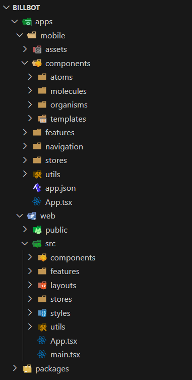

# Caso 2

# System name - Billbot
Marcelo Gomez
Isaac Rojas
Juan Carlos Valverde

## Description: 
Payment Assistant is a smart financial assistant that helps users automate and manage their recurring payments safely and easily. With voice commands, users can set up and confirm payments, ensuring they never miss a bill. The system connects with major banking APIs and offers flexible subscription plans based on transaction volume.

Key Features:
- Secure Transactions: Uses strong encryption and follows PCI DSS security standards.
- Bank Integration: Connects directly to banking APIs for seamless payments.
- Voice Command Payments: Users can manage payments hands-free with AI-powered voice recognition.
- Smart Payment Reminders: Sends real-time alerts and notifications to keep users on track.
- Scalable Infrastructure: Built to handle growth and ensure reliable performance.

## Stack: write down the final stack to be use decided for the group
- Frontend: React Native (Expo) for mobile development, ReactJS for web
- Backend: Node.js (NestJS) with GraphQL API
- Database: PostgreSQL (Amazon RDS) for structured data, DynamoDB for logs
- Cloud & Hosting: AWS Fargate, API Gateway, AWS Lambda
- Authentication: AWS Cognito (OAuth, MFA, SSO support)
- DevOps & QA: AWS CodePipeline, AWS X-Ray, AWS CloudWatch Synthetics
- Security: AWS WAF, AWS Secrets Manager, AWS Security Hub
- AI/NLP: Amazon Transcribe & Lex for voice processing
- 3rd-Party Integrations: Twilio (SMS), Stripe (Subscriptions), SINPE/BAC APIs (Banking)

## Frontend design specifications


### Authentication platform", Conduct research to determine which service platform you will use for authentication, ensuring that it offers at least:

#### Chosen platform: AWS Cognito
AWS Cognito meets all authentication requirements:

- Login and password authentication
- SDK for screen generation and API access
- Fully compatible with React Native and ReactJS
- Multi-Factor Authentication (MFA) available
- Sandbox for testing authentication flows

Implementation Steps:

- Configure Cognito User Pool and Identity Pool in AWS.
- Implement authentication flow in React Native using Amplify SDK.
- Customize UI components for login/signup screens.
- Use Postman to test MFA API calls and store results in the repository.


Repository Structure
```
/src
  ├── App.js                     # Uses Amplify Authenticator
  ├── aws-exports.js            # AWS backend config
  └── components/
        └── LoginForm.js        # Optional custom login
/docs
  └── PaymentAssistant_AuthTests.postman_collection.json
```

Code Implementation:
```
// LoginForm.js (Custom)
import React, { useState } from 'react';
import { Auth } from 'aws-amplify';

export default function LoginForm() {
  const [email, setEmail] = useState('');
  const [password, setPassword] = useState('');
  const [error, setError] = useState(null);

  const handleSignIn = async (e) => {
    e.preventDefault();
    try {
      await Auth.signIn(email, password);
      alert('Login successful');
    } catch (err) {
      setError(err.message);
    }
  };

  return (
    <div style={{ maxWidth: '400px', margin: 'auto', padding: '2rem' }}>
      <h2>Login</h2>
      <form onSubmit={handleSignIn} style={{ display: 'flex', flexDirection: 'column' }}>
        <input
          type="email"
          placeholder="Email"
          value={email}
          onChange={(e) => setEmail(e.target.value)}
          required
          style={{ marginBottom: '1rem', padding: '0.5rem' }}
        />
        <input
          type="password"
          placeholder="Password"
          value={password}
          onChange={(e) => setPassword(e.target.value)}
          required
          style={{ marginBottom: '1rem', padding: '0.5rem' }}
        />
        <button type="submit" style={{ padding: '0.5rem', backgroundColor: '#007bff', color: 'white' }}>
          Login
        </button>
        {error && <p style={{ color: 'red', marginTop: '1rem' }}>{error}</p>}
      </form>
    </div>
  );
}
```

Cognito MFA Postman Collection:

```
{
  "info": {
    "name": "AWS Cognito MFA Simulation",
    "schema": "https://schema.getpostman.com/json/collection/v2.1.0/collection.json",
    "_postman_id": "fictitious-id-1234"
  },
  "item": [
    {
      "name": "1 - InitiateAuth",
      "request": {
        "method": "POST",
        "header": [
          {
            "key": "Content-Type",
            "value": "application/x-amz-json-1.1"
          },
          {
            "key": "X-Amz-Target",
            "value": "AWSCognitoIdentityProviderService.InitiateAuth"
          }
        ],
        "body": {
          "mode": "raw",
          "raw": "{\n  \"AuthParameters\": {\n    \"USERNAME\": \"testuser@example.com\",\n    \"PASSWORD\": \"TestPassword123!\"\n  },\n  \"AuthFlow\": \"USER_PASSWORD_AUTH\",\n  \"ClientId\": \"3bt4exampleclientidfoo9vvv6\"\n}"
        },
        "url": {
          "raw": "https://cognito-idp.us-west-2.amazonaws.com/",
          "protocol": "https",
          "host": [
            "cognito-idp",
            "us-west-2",
            "amazonaws",
            "com"
          ],
          "path": [
            ""
          ]
        }
      }
    },
    {
      "name": "2 - RespondToAuthChallenge",
      "request": {
        "method": "POST",
        "header": [
          {
            "key": "Content-Type",
            "value": "application/x-amz-json-1.1"
          },
          {
            "key": "X-Amz-Target",
            "value": "AWSCognitoIdentityProviderService.RespondToAuthChallenge"
          }
        ],
        "body": {
          "mode": "raw",
          "raw": "{\n  \"ChallengeName\": \"SOFTWARE_TOKEN_MFA\",\n  \"ClientId\": \"3bt4exampleclientidfoo9vvv6\",\n  \"ChallengeResponses\": {\n    \"USERNAME\": \"testuser@example.com\",\n    \"SOFTWARE_TOKEN_MFA_CODE\": \"123456\"\n  },\n  \"Session\": \"EXAMPLESESSIONTOKEN==\"\n}"
        },
        "url": {
          "raw": "https://cognito-idp.us-west-2.amazonaws.com/",
          "protocol": "https",
          "host": [
            "cognito-idp",
            "us-west-2",
            "amazonaws",
            "com"
          ],
          "path": [
            ""
          ]
        }
      }
    },
    {
      "name": "3 - Authenticated API Request",
      "request": {
        "method": "GET",
        "header": [
          {
            "key": "Authorization",
            "value": "Bearer {{AccessToken}}"
          }
        ],
        "url": {
          "raw": "https://myapi.example.com/user/profile",
          "protocol": "https",
          "host": [
            "myapi",
            "example",
            "com"
          ],
          "path": [
            "user",
            "profile"
          ]
        }
      }
    }
  ]
}
```

InitiateAuth


Response:
```
{
  "ChallengeName": "SOFTWARE_TOKEN_MFA",
  "Session": "EXAMPLESESSIONTOKEN=="
}
```

RespondToAuthChallenge


Response:
```
{
  "ChallengeName": "SOFTWARE_TOKEN_MFA",
  "ClientId": "3bt4exampleclientidfoo9vvv6",
  "ChallengeResponses": {
    "USERNAME": "testuser@example.com",
    "SOFTWARE_TOKEN_MFA_CODE": "123456"
  },
  "Session": "EXAMPLESESSIONTOKEN=="
}
```

Autheticated API Request


#### Client Architecture

The application follows an N-layer architecture, where:

- The frontend (React Native/ReactJS) communicates with the backend via GraphQL API.
- The backend (NestJS + Node.js) serves as the business logic layer, interacting with the database and external banking APIs.
- The database (PostgreSQL + DynamoDB) stores user payment configurations and transaction logs.
- The authentication layer (Cognito) manages user sessions and authorization.
- Cloud infrastructure (AWS Fargate, API Gateway, Lambda) ensures scalability and resilience.

The mobile application is built with React Native (hybrid approach), and the web version is implemented with ReactJS using client-side rendering (CSR). The state is managed using Redux Toolkit, allowing seamless synchronization between different user interactions.

The frontend communicates with backend services via GraphQL APIs, ensuring optimized data retrieval. Transactions, authentication, and user settings are managed through secure API calls with AWS API Gateway, protecting endpoints against malicious traffic.

#### Visual Components

##### Patterns & Principles

- SOLID principles: Used in the backend to ensure maintainability and scalability.
- DRY principle: Applied throughout the codebase to avoid redundancy and improve reusability.
- Separation of Concerns (SoC): Ensures clear division between frontend, backend, and database logic.
- Responsive Design: Implemented in the frontend using Tailwind CSS to support various screen sizes.
- Atomic Design: Used in React components for reusable UI elements.
- State management with Redux: Ensures efficient data handling and UI updates across all components.

##### Toolkits and Standards
- AWS Amplify UI components: For authentication screens and easy Cognito integration.
- Tailwind CSS: For maintaining consistent and responsive UI design.
- Storybook: For UI component testing in isolation.
- Material Design Guidelines: Ensures consistent UI/UX experience across platforms.
- Chakra UI: Provides flexible, accessible components for better frontend development.

##### Object Design Patterns

The application follows object-oriented design patterns such as:

- Factory Pattern: Used in the backend to create instances of payment services dynamically, ensuring modularity.
- Singleton Pattern: Manages authentication state across different components to prevent unnecessary re-initialization.
- Observer Pattern: Enables real-time updates for notifications and payment statuses through WebSockets.    
- Adapter Pattern: Standardizes API responses from different banks to maintain consistency and ensure compatibility.
- Strategy Pattern: Used in payment processing to handle different payment methods dynamically (e.g., card, bank transfer, digital wallet).
- Command Pattern: Manages transactional operations to ensure they can be executed, rolled back, or retried if needed.


### External Services

The system integrates with various external services to enhance its functionality:

- Authentication & Authorization: AWS Cognito (OAuth, MFA, SSO). Manages user authentication and authorization, ensuring secure access to the application.
- Payments & Banking APIs: Stripe (subscription plans), SINPE/BAC APIs (automated transactions). Handles subscription billing for different user plans and payment verification.
- Cloud Storage: AWS S3 (for storing logs and voice command data)
- AI/NLP Processing: Amazon Transcribe & Lex (voice recognition for payments)
- Notifications & Messaging: Twilio (SMS notifications), AWS SNS (push notifications)
- Security & Compliance: AWS Security Hub, AWS WAF, AWS Payment Cryptography for PCI DSS compliance

<!-- 
a) login y password

b) login y password automatic screen generation or SDK for screen generation

c) compatible with your FE programming language

d) access by API available

e) MFA and a sandbox for testing purpose

Using a demo code, proceed to test how the chosen platform works and how the login screen can be customized. Document this process in the MD file. The demo code must be use in the selected programming language of the FE.

Using Postman, make API calls to simulate authentication with MFA. Document the process and save your own Postman collection for future review

suggested platforms to look into: auth0, okta, cognito, MS entra, onelogin, firebase, veriam -->

### Project structure



#### Function of the directories:
#### apps/
<div style="padding-left: 20px"> 
mobile/ -- React Native app<br>
<div style="padding-left: 20px"> 
assets/ -- Assets for the app (images, fonts, etc.)<br>

components/ -- Reusable components, key aspect in atomic design (atoms (buttons, inputs), molecules (forms, input groups), organisms (headers, navigation bars) and tamplates)<br>

<div style="padding-left: 20px">  

</div> 
features/ -- Feature-based modules <br> 
<div style="padding-left: 20px"> 
auth/ -- Authentication flows<br>  
payments/ -- Payment management<br>  
notifications/ -- Directory for the notifications feature<br> 
settings/ -- User settings<br>  
</div>   <br>

navigation/ -- App navigation setup<br>
stores/ -- Directory state management<br>
utils/ -- Helper functions, hooks<br>
App.tsx -- Main app entry point<br>
app.json -- Expo config<br>
</div> 
</div>

<div style="padding-left: 20px"> 
web/ -- ReactJS web app<br>
<div style="padding-left: 20px"> 
public/ -- Static files<br>

<div style="padding-left: 20px">  
 
</div> 
src/
<div style="padding-left: 20px"> 
components/ -- Reusable UI components<br> 
features/ -- Feature modules<br>
layouts/ -- Page layouts<br>  
stores/ -- Centralizes all global state management<br>  
styles/ -- Global styles (Tailwind config)<br> 
utils/ -- Helpers, custom hooks<br>   
App.tsx -- Web entry point<br> 
main.tsx -- React root<br> 
</div>

</div>
</div>  

#### infrastructure/ -- AWS Infrastructure
<div style="padding-left: 20px">  
cognito/ -- Cognito User/Identity Pool setup <br>
database/ -- RDS (PostgreSQL) + DynamoDB configs <br>
networking/ -- VPC, API Gateway, WAF rules <br> 
serverless/ -- Lambda functions   
storage/ -- S3 buckets for logs/voice data  <br> 
monitoring/ -- CloudWatch, X-Ray configs  <br>
</div> 

#### packages/
<div style="padding-left: 20px"> 
api/ -- NestJS Backend<br>
<div style="padding-left: 20px">  
src/<br> 
<div style="padding-left: 20px"> 
auth/ -- Auth module (with Cognito)<br> 
payments/ -- Payment processing logic<br> 
notifications/ -- Notification services<br> 
users/ -- User management<br> 
common/ -- Common decorators, filters, etc.<br> 
config/ -- AWS database configs<br> 
graphql/ -- GraphQL schema/resolvers<br> 
models/ -- Database models (TypeORM)<br> 
utils/ -- Helpers, validators<br> 
app.module.ts -- Root module<br> 
main.ts -- Entry point<br>
</div> 
test/ -- Integration/unit tests<br> 
</div> <br> 
core/ -- Shared code (TS libraries)<br> 
<div style="padding-left: 20px"> 
dtos/ -- Shared data transfer objects<br> 
interfaces/ -- Common interfaces<br> 
constants/ -- Enums, config constants<br> 
utils/ -- Cross-platform utilities<br> 
</div>
</div>

#### scripts/
<div style="padding-left: 20px"> 
deploy/ -- Deployment scripts<br> 
db/ -- Database migrations/seeding<br> 
test/ -- Test automation<br> 
</div>

### Final FE architecture diagram


#### Class Diagram


## Backend Design Specifications

### Proof of Concepts
- #### 1- Handler Responsibilities (SOLID & Cohesion Principle)
  - POC Step 1: The handlers responsibilities need to be clearly defined and it was decided to create a data save handler and a data fetch handler that can access AWS and perform simple POST and GET requests.
  
  - POC Step 2: As there was no clear difference in the code of the two handlers, it was decided to better distribute the responsibilities in each of them in order to follow the SOLID principle. In addition, other problems were solved, such as the handlers calling directly to the repositories. This was solved by making a better management of the repository.
  
  - POC Step 3: The advantages over the template handlers are the explicit separation of functions, each handler has a single purpose, making them easy to maintain and scale without affecting the functionality of the individual handlers.  

- #### 3- Logger Improvements (Design Pattern Required)  
  - POC Step 1: The main problem of the logger was that its functionality was too simple and did not provide more than a message with a timestamp, so it was decided to create a logger for AWS CloudWatch (which ensures that the logs are not lost, unlike the `console.log`) with a strategy pattern that allows to create different types of logs that can be used according to the context.

  - POC Step 2: The next problem to solve is to make this logger agnostic so that it can use different logger implementations, that is why this pattern is used, because it can use the logger implementation of preference by just using and implementing the interface and changing a variable in the `.env` file without having to change anything about the logger in any other file.

  - POC Step 3: The advantages of this approach over the one established in the template are for example that there is a better structured logging that allows the possibility of filtering and the possibility of interchanging logger implementation as preferred without intervening in other parts of the system.

- #### 4- Optional & Mandatory Middleware
  - POC Step 1: The main problems in this point were implementing middlewares than can be chained up and making these optional or obligatory at election. These problems were solved using the chain of responsibility pattern which, as its name suggests, chains up handlers (in this case middlewares) to perform a specific action and perform a flow of different actions. Part of the solution was also to implement a class where all middlewares that are going to be used can inherit and remain as modular as possible, also to adress the problem of optional and mandatory middlewares the middlewares that are optional have a flag that can be toggled on and off at the time of making the chain to skip the middleware and the mandatory middlewares do not have this option making them always execute (if included in the chain).
  
  - POC Step 2: The advantages of the implemented solutions compared to the template are its flexibility where middlwares can be created following a defined structure and easily added or removed from the chain just by using a flag in the handler that will be used, which practically does not need to make changes in other parts of the system.

- #### 5-Repository Layer Improvements
  - POC Step 1: The main problem in this section was that handlers directly instantiated repositories that mixed business logic with data management, which cannot be done. This was solved by adding a services layer that acts as an intermediary between handlers and repositories, so that the handlers "don't know" about DynamoDB, and the repository is now in a new file that accesses the database and creates three basic functions to peform as an example (one save and two get).
  
  - POC Step 2: This approach makes it easy to change database sources, something that was impossible in the template, and as mentioned before, the new layer ensures transparency for the handlers, something that does not exist in the template.

- #### 6- Deployment & Testing 
  - POC Step 1: The problem referred to in this section is that there was no way to test properly at all, so the solution was to implement unit tests to test the performance of the two handlers and at the same time all the other layers implemented.
  
  - POC Step 2:


## Backend Architecture

1. API and Application Architecture
We chose to use GraphQL to build our API. This allows the frontend to ask for exactly the data it needs, making our app faster and more efficient—especially important when we have both web and mobile users.

Instead of using a monolithic structure, we're going with an N-layer (modular) architecture. This means our code is organized into layers:

One layer handles incoming requests.

Another handles business logic (the rules of our app).

Another talks to the database.

And finally, one more connects with external services like banks or SMS providers.

This makes our app easier to manage, test, and grow over time.

2. Internal Layers for Requests and Responses
Our application will handle requests in this order:

GraphQL Resolver Layer – receives and routes the request.

Service Layer – handles logic like “is this a valid payment?” or “should I send a notification?”

Repository Layer – reads/writes to the database.

External API Adapter Layer – connects to banks, Stripe, and voice tools like Amazon Lex.

3. Object Design Patterns in Action
We use some popular object-oriented programming patterns to organize logic:

Factory: Helps choose the correct bank/payment processor depending on the user’s setup.

Adapter: Transforms responses from different banks into a single format our app understands.

Observer: Listens for events like “payment succeeded” and sends a notification automatically.

Command: Wraps payment actions so we can retry them or cancel them if needed.

Strategy: Chooses between different payment types (credit card, SINPE, etc.).

These patterns help us write code that is more modular, reusable, and testable.

4. Hosting Model: Serverless Cloud on AWS
We’re using AWS Cloud with a serverless architecture:

That means we don’t manage the servers ourselves.

AWS automatically scales the app up or down based on usage.

It’s cost-effective and great for apps that start small but grow fast.

We’ll use:

Lambda for background tasks (like reminders).

Fargate to run backend services in containers.

Aurora Serverless (PostgreSQL) and DynamoDB for databases.

5. Hardware and Cloud Machines
We don’t need fixed hardware. Instead, we’ll use:

AWS Fargate: lets us run containers without worrying about servers.

AWS Lambda: runs small functions on demand, perfect for processing payments or events.

Aurora (PostgreSQL): auto-scaling relational database.

DynamoDB: for fast access to logs and transaction history.

This setup lets us grow from a few hundred to tens of thousands of users without major changes.

6. Tech Stack and Tools

| Part of the App	Tool | Why We Use It |
| --------- | -------- |
| Frontend ReactJS / React Native	| Shared components for mobile & web |
| Backend Node.js + NestJS |	Structured and scalable backend |
| API GraphQL |	Flexible data fetching |
| Auth AWS Cognito | Secure login, supports MFA |
| DB PostgreSQL (Aurora), DynamoDB | Structured and fast access to records |
| Voice Commands Amazon Lex, Transcribe |	AI-powered voice processing |
| Notifications Twilio, SNS | SMS and push notifications |
| Infra as Code AWS Amplify, CDK | Set up cloud infrastructure programmatically |

7. Service vs. Microservices
We’re building a modular monolith for now:

It’s a single codebase, but divided into logical services:

UserService, PaymentService, NotificationService, and VoiceCommandService.

Later, if needed, we can split them into microservices.

This makes it easier for small teams to collaborate without needing complex deployment pipelines.

8. Event-Driven Features and Messaging
Some parts of our app need to react to events, like when a payment is successful or a reminder needs to be sent.

So we’ll use:

SQS (Simple Queue Service) to manage tasks like sending reminders.

SNS (Simple Notification Service) to push alerts via SMS or app notifications.

EventBridge to trigger workflows (like “voice command received”).

These tools make the system more reliable and scalable—especially useful when there are lots of users doing things at the same time.

9. PI Gateway for Security and Scalability
Yes—we need an API Gateway.

We’re using AWS API Gateway, which:

Acts as the single entry point to our backend.

Checks if users are logged in (JWT from Cognito).

Supports rate limiting (protects us from abuse).

Can connect securely to our backend (Lambda, Fargate).

This helps us keep things secure, organized, and scalable.

✅ Summary Table
| Category	| Decision |
| --------- | -------- |
| API Type  | GraphQL for app, REST for bank/payment APIs |
| Architecture | Modular Monolith with N-layer design |
| Hosting | Serverless on AWS (Lambda, Fargate) |
| Request Flow | Resolver → Service → Repository → Adapter |
| Design Patterns |	Factory, Adapter, Observer, Command, Strategy |
| Messaging | SQS, SNS, EventBridge |
| Gateway |	AWS API Gateway for all entry points |
| Scalability |	Auto-managed by AWS |
| Team Structure | Organized by service modules (Payments, Users, etc.) |


# Data Layer Design

## a) Data Topology:

**Cloud Service Technology:**
- **AWS RDS (PostgreSQL)** for OLTP and **DynamoDB** for NoSQL. We use AWS for its scalability, high availability, and geographic replication.

**Object-Oriented Design Patterns:**
- **Singleton Pattern**: To manage database connections, ensuring there is a single active instance for the entire system.
- **Factory Pattern**: To create database service instances, allowing the choice between different database providers (relational or NoSQL).

**Class Layers for Data Access:**
- **DataAccessLayer**: Layer responsible for managing data access.
- **DBConnection**: Layer that handles the database connection, maintaining credentials and configurations.
- **TransactionManager**: Responsible for managing transactions in the databases.

**Configuration Policies/Rules:**
- **Connection Pooling**: Configuration of AWS RDS Connection Pooling to optimize the use of database connections.
- **Data Replication**: Data replication policies in RDS to ensure availability and fault recovery.

**Expected Benefits:**
- **Scalability**: With AWS RDS and DynamoDB, the architecture can scale horizontally without manual intervention.
- **High availability**: Geographical replication and fault recovery policies ensure continuous data availability.

---

## b) Big Data Repositories:

**Cloud Service Technology:**
- **AWS S3**: For storing large volumes of unstructured data.
- **AWS Glue**: For transforming and processing large volumes of data.

**Object-Oriented Design Patterns:**
- **Factory Pattern**: To create adapters for connecting to different Big Data repositories (S3, DynamoDB, etc.).
- **Composite Pattern**: To organize data hierarchically (e.g., voice logs or transactional data).

**Class Layers for Data Access:**
- **DataLakeRepository**: Layer that manages access to Big Data repositories like S3.
- **BigDataProcessor**: Layer responsible for processing large volumes of data, such as voice logs or transactions.

**Configuration Policies/Rules:**
- **Data Partitioning**: Use of partitions in S3 to distribute large volumes of data across multiple buckets to avoid performance issues.
- **Data Processing**: Define processing policies using AWS Glue to handle and transform data.

**Expected Benefits:**
- **Data management efficiency**: Using AWS Glue enables scalable and cost-effective processing of large data volumes.
- **Optimized costs**: By using S3 and Glue, data storage and processing can be done at a fraction of the cost compared to traditional storage and processing solutions.

---

## c) Relational Database vs NoSQL:

**Cloud Service Technology:**
- **AWS RDS (PostgreSQL)**: Relational database.
- **DynamoDB**: NoSQL database for unstructured data and high scalability.

**Object-Oriented Design Patterns:**
- **Adapter Pattern**: To create a layer that adapts operations between relational databases (RDS) and NoSQL (DynamoDB).
- **Proxy Pattern**: To control access to databases and add functionalities like caching and access control without modifying business logic.

**Class Layers for Data Access:**
- **RelationalDBAdapter**: Layer that abstracts SQL operations in PostgreSQL.
- **NoSQLDBAdapter**: Layer that abstracts operations in DynamoDB, providing a common interface.
- **DataMapper**: Maps business objects to data stored in databases.

**Configuration Policies/Rules:**
- **Transaction Management**: Policy for securely managing transactions in PostgreSQL, while using DynamoDB's transaction system for NoSQL.
- **Indexing**: Create efficient indexes in both databases to optimize queries.

**Expected Benefits:**
- **Flexibility**: Both structured and unstructured data can be managed using the appropriate technologies for each data type.
- **Optimized Queries**: The use of indexes in PostgreSQL and DynamoDB ensures that queries are fast and efficient, regardless of the database type.

---

## d) Data Tenancy and Access Permissions:

**Cloud Service Technology:**
- **AWS Cognito**: To manage user authentication and authorization.
- **AWS IAM**: To manage permissions and access policies for data.

**Object-Oriented Design Patterns:**
- **Strategy Pattern**: To implement different authentication strategies based on the user type (e.g., admin users, standard users).
- **Decorator Pattern**: To add security functionalities to business entities without modifying their internal structure.

**Class Layers for Data Access:**
- **AuthenticationManager**: Layer responsible for managing authentication via AWS Cognito.
- **PermissionManager**: Layer responsible for managing data access permissions using AWS IAM.

**Configuration Policies/Rules:**
- **Role-Based Access Control (RBAC)**: Define roles and permissions in AWS IAM to control access to sensitive functions and data.
- **Multi-Factor Authentication (MFA)**: Configure MFA in AWS Cognito for an additional layer of security.

**Expected Benefits:**
- **Security**: AWS Cognito ensures that only authorized users can access sensitive resources.
- **Scalability in Security**: AWS IAM allows dynamic scaling of permissions according to business needs.

---

## e) Fault Recovery and Resilience:

**Cloud Service Technology:**
- **AWS Aurora**: Relational database with high availability and automatic recovery.
- **AWS Lambda**: Serverless functions to handle processes in case of failures.

**Object-Oriented Design Patterns:**
- **Observer Pattern**: To monitor the system's state and trigger recovery processes automatically when a failure is detected.
- **Command Pattern**: To manage operations that need to be executed, rolled back, or retried in case of failures.

**Class Layers for Data Access:**
- **RecoveryManager**: Layer responsible for recovery from failures and managing backups.
- **ErrorHandler**: Layer responsible for handling system errors and managing retry logic.

**Configuration Policies/Rules:**
- **Failover Policies**: Configure automatic failover policies in AWS Aurora to ensure service continuity in case of database instance failure.
- **Backup & Restore**: Configure automatic daily backups in AWS Aurora and DynamoDB.

**Expected Benefits:**
- **High availability**: The AWS Aurora architecture ensures that the database recovers quickly in case of a failure.
- **Efficient recovery**: AWS Lambda functions allow for fast and automatic fault recovery, enhancing the system's resilience.

---

## a) Transactional via Statements or Stored Procedures:

**Cloud Service Technology:**

- **AWS RDS (PostgreSQL)**: We use Stored Procedures to handle complex transactional operations efficiently and ensure transactions are atomic.
- **DynamoDB**: Uses DynamoDB Transactions to guarantee consistency of transactions in NoSQL data.

**Object-Oriented Design Patterns:**
- **Command Pattern**: Used to encapsulate database operations into objects that can be executed, rolled back, or retried.
- **Transaction Script Pattern**: Used to handle transactions via stored procedures encapsulating business logic.

**Class Layers for Data Access:**
- **TransactionManager**: Layer that manages transactions, executing Stored Procedures in relational databases and controlling transactions in DynamoDB.
- **QueryExecutor**: Layer responsible for executing SQL statements or queries in DynamoDB.

**Configuration Policies/Rules:**
- **Transaction Handling**: Ensure transactions are managed consistently via Stored Procedures or DynamoDB Transactions.
- **Isolation Levels**: Configure appropriate isolation levels in relational databases (e.g., READ COMMITTED, SERIALIZABLE) to handle concurrency and locking.

**Expected Benefits:**
- **Efficiency**: Using Stored Procedures allows complex operations to be handled efficiently directly in the database, reducing application overhead.
- **Consistency**: Transactions are handled reliably, preventing data inconsistencies in the system.

---

## b) Use of ORM (Object-Relational Mapping):

**Cloud Service Technology:**
- **TypeORM** or **Sequelize (PostgreSQL)** for interacting with relational databases.
- **DynamoDB SDK** for interacting with NoSQL databases.

**Object-Oriented Design Patterns:**
- **Data Mapper Pattern**: Used to map domain objects to databases, decoupling business logic from the persistence layer.
- **Active Record Pattern**: Used in some ORMs like Sequelize, where domain objects have their own data access logic.

**Class Layers for Data Access:**
- **EntityManager**: Layer that manages ORM entities and their persistence in the databases.
- **Repository**: Layer that abstracts CRUD operations and specific queries, interacting with entities.
- **Model**: Defines entities and their structure in the database.

**Configuration Policies/Rules:**
- **Entity Mappings**: Configuration of mappings between database tables and domain object classes.
- **Validation Rules**: Define validation rules to ensure that entered data is consistent and correct before persistence.

**Expected Benefits:**
- **Abstraction**: Using ORM allows business logic to be decoupled from database interaction, making code cleaner and more maintainable.
- **Development Ease**: ORM simplifies data access operations by automatically generating the corresponding SQL queries.

---

## c) Layers for Connection Control, Concurrency, Mapping Data to Objects and Vice Versa:

**Cloud Service Technology:**
- **AWS RDS Connection Pooling** to manage multiple database connections without creating new instances for each request.
- **DynamoDB Auto-Scaling** to handle concurrency without manual intervention.

**Object-Oriented Design Patterns:**
- **Proxy Pattern**: To control access to database connections and apply layers of security and optimization.
- **Observer Pattern**: Used to handle concurrency events, notifying interested layers about changes in data.

**Class Layers for Data Access:**
- **ConnectionPool**: Layer responsible for managing connection pooling to the database, reusing existing connections.
- **DataMapper**: Layer that converts data between the database format and domain object format.
- **ConcurrencyManager**: Layer responsible for managing concurrency conflicts and ensuring data consistency in multi-user systems.

**Configuration Policies/Rules:**
- **Connection Pool Size**: Configure the number of active connections in the pool, optimizing resource usage.
- **Concurrency Control**: Define concurrency control models, such as optimistic or pessimistic locking, depending on system needs.

**Expected Benefits:**
- **Connection Management Efficiency**: Connection pooling improves performance by avoiding repeated creation of new connections.
- **Concurrency Management**: Ensures that multiple users can interact with the database without data conflicts.

---

## d) Use of Connection Pooling:

**Cloud Service Technology:**
- **AWS RDS Connection Pooling** with pg-pool for PostgreSQL and **DynamoDB Connection Pooling** for NoSQL.

**Object-Oriented Design Patterns:**
- **Singleton Pattern**: To ensure there is only one instance of the connection pool for the entire application.

**Class Layers for Data Access:**
- **ConnectionPoolManager**: Layer responsible for managing the connection pool and distributing connections as needed.

**Configuration Policies/Rules:**
- **Maximum Connections**: Configure the maximum number of connections allowed in the pool.
- **Timeouts**: Configure the wait times for obtaining a connection from the pool.

**Expected Benefits:**
- **Improved Performance**: Connection pooling reduces database overhead by reusing existing connections instead of creating new ones constantly.
- **Reduced Latency**: Connections are managed efficiently, reducing the wait time for establishing new connections.

---

## e) Use of Cache:

**Cloud Service Technology:**
- **AWS ElastiCache** (Redis or Memcached) for caching frequent data and expensive queries.

**Object-Oriented Design Patterns:**
- **Cache-Aside Pattern**: Where the application handles loading and updating the cache manually, while the database is the source of truth.

**Class Layers for Data Access:**
- **CacheManager**: Layer responsible for storing and retrieving data from the cache.

**Configuration Policies/Rules:**
- **Cache Expiry**: Define an expiration time for cached data to avoid using outdated data.
- **Cache Invalidation**: Policies to invalidate or update the cache when underlying data changes.

**Expected Benefits:**
- **Performance Improvement**: Caching reduces the load on the database by storing frequent query results in memory.
- **Scalability**: Caching reduces the need to access the database, allowing the system to handle more traffic.

---

## f) Native and Interpreted Drivers:

**Cloud Service Technology:**
- **AWS SDK**: Used to interact with databases like DynamoDB and RDS, providing native access to AWS services.

**Object-Oriented Design Patterns:**
- **Adapter Pattern**: To adapt different types of native and interpreted drivers depending on the database used.

**Class Layers for Data Access:**
- **DriverManager**: Layer responsible for managing native and interpreted drivers to interact with the database.

**Configuration Policies/Rules:**
- **Driver Configuration**: Configuring connection parameters such as timeout and authentication for native and interpreted drivers.

**Expected Benefits:**
- **Flexibility**: Native drivers provide faster access to the database, while interpreted drivers allow greater flexibility with various database systems.
- **Compatibility**: Using patterns like Adapter allows for easier integration with multiple database systems.

---

## g) Data Design:

**Cloud Service Technology:**
- **AWS DynamoDB** for NoSQL storage and **AWS RDS (PostgreSQL)** for relational storage.

**Object-Oriented Design Patterns:**
- **Composite Pattern**: For handling hierarchical data such as transactions and users in an organized structure.
- **Entity-Component-System (ECS)**: For designing complex entities with reusable components and systems that process them.

**Class Layers for Data Access:**
- **Entity**: Represents business entities like User, Transaction, Payment.
- **DataObject**: Defines the data for each entity, such as the structure of database tables.

**Configuration Policies/Rules:**
- **Normalization**: Normalization policies to reduce data redundancy in relational databases.
- **Data Denormalization**: Use of denormalization in NoSQL databases to optimize queries and performance.

**Expected Benefits:**
- **Efficiency**: Normalization and denormalization allow for a data design that optimizes queries and storage based on the type of database.
- **Clarity**: Separating entities and data objects makes the system clearer and easier to maintain.
