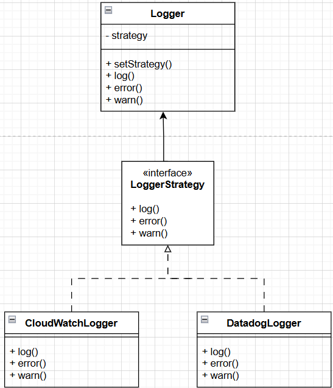

# Caso 2

# System name - Billbot
Marcelo Gomez
Isaac Rojas
Juan Carlos Valverde

## Description: 
Payment Assistant is a smart financial assistant that helps users automate and manage their recurring payments safely and easily. With voice commands, users can set up and confirm payments, ensuring they never miss a bill. The system connects with major banking APIs and offers flexible subscription plans based on transaction volume.

Key Features:
- Secure Transactions: Uses strong encryption and follows PCI DSS security standards.
- Bank Integration: Connects directly to banking APIs for seamless payments.
- Voice Command Payments: Users can manage payments hands-free with AI-powered voice recognition.
- Smart Payment Reminders: Sends real-time alerts and notifications to keep users on track.
- Scalable Infrastructure: Built to handle growth and ensure reliable performance.

## Stack: write down the final stack to be use decided for the group
- Frontend: React Native (Expo) for mobile development, ReactJS for web
- Backend: Node.js (NestJS) with GraphQL API
- Database: PostgreSQL (Amazon RDS) for structured data, DynamoDB for logs
- Cloud & Hosting: AWS Fargate, API Gateway, AWS Lambda
- Authentication: AWS Cognito (OAuth, MFA, SSO support)
- DevOps & QA: AWS CodePipeline, AWS X-Ray, AWS CloudWatch Synthetics
- Security: AWS WAF, AWS Secrets Manager, AWS Security Hub
- AI/NLP: Amazon Transcribe & Lex for voice processing
- 3rd-Party Integrations: Twilio (SMS), Stripe (Subscriptions), SINPE/BAC APIs (Banking)

## Frontend design specifications


### Authentication platform", Conduct research to determine which service platform you will use for authentication, ensuring that it offers at least:

#### Chosen platform: AWS Cognito
AWS Cognito meets all authentication requirements:

- Login and password authentication
- SDK for screen generation and API access
- Fully compatible with React Native and ReactJS
- Multi-Factor Authentication (MFA) available
- Sandbox for testing authentication flows

Implementation Steps:

- Configure Cognito User Pool and Identity Pool in AWS.
- Implement authentication flow in React Native using Amplify SDK.
- Customize UI components for login/signup screens.
- Use Postman to test MFA API calls and store results in the repository.


Repository Structure
```
/src
  ├── App.js                     # Uses Amplify Authenticator
  ├── aws-exports.js            # AWS backend config
  └── components/
        └── LoginForm.js        # Optional custom login
/docs
  └── PaymentAssistant_AuthTests.postman_collection.json
```

Code Implementation:
```
// LoginForm.js (Custom)
import React, { useState } from 'react';
import { Auth } from 'aws-amplify';

export default function LoginForm() {
  const [email, setEmail] = useState('');
  const [password, setPassword] = useState('');
  const [error, setError] = useState(null);

  const handleSignIn = async (e) => {
    e.preventDefault();
    try {
      await Auth.signIn(email, password);
      alert('Login successful');
    } catch (err) {
      setError(err.message);
    }
  };

  return (
    <div style={{ maxWidth: '400px', margin: 'auto', padding: '2rem' }}>
      <h2>Login</h2>
      <form onSubmit={handleSignIn} style={{ display: 'flex', flexDirection: 'column' }}>
        <input
          type="email"
          placeholder="Email"
          value={email}
          onChange={(e) => setEmail(e.target.value)}
          required
          style={{ marginBottom: '1rem', padding: '0.5rem' }}
        />
        <input
          type="password"
          placeholder="Password"
          value={password}
          onChange={(e) => setPassword(e.target.value)}
          required
          style={{ marginBottom: '1rem', padding: '0.5rem' }}
        />
        <button type="submit" style={{ padding: '0.5rem', backgroundColor: '#007bff', color: 'white' }}>
          Login
        </button>
        {error && <p style={{ color: 'red', marginTop: '1rem' }}>{error}</p>}
      </form>
    </div>
  );
}
```

Cognito MFA Postman Collection:

```
{
  "info": {
    "name": "AWS Cognito MFA Simulation",
    "schema": "https://schema.getpostman.com/json/collection/v2.1.0/collection.json",
    "_postman_id": "fictitious-id-1234"
  },
  "item": [
    {
      "name": "1 - InitiateAuth",
      "request": {
        "method": "POST",
        "header": [
          {
            "key": "Content-Type",
            "value": "application/x-amz-json-1.1"
          },
          {
            "key": "X-Amz-Target",
            "value": "AWSCognitoIdentityProviderService.InitiateAuth"
          }
        ],
        "body": {
          "mode": "raw",
          "raw": "{\n  \"AuthParameters\": {\n    \"USERNAME\": \"testuser@example.com\",\n    \"PASSWORD\": \"TestPassword123!\"\n  },\n  \"AuthFlow\": \"USER_PASSWORD_AUTH\",\n  \"ClientId\": \"3bt4exampleclientidfoo9vvv6\"\n}"
        },
        "url": {
          "raw": "https://cognito-idp.us-west-2.amazonaws.com/",
          "protocol": "https",
          "host": [
            "cognito-idp",
            "us-west-2",
            "amazonaws",
            "com"
          ],
          "path": [
            ""
          ]
        }
      }
    },
    {
      "name": "2 - RespondToAuthChallenge",
      "request": {
        "method": "POST",
        "header": [
          {
            "key": "Content-Type",
            "value": "application/x-amz-json-1.1"
          },
          {
            "key": "X-Amz-Target",
            "value": "AWSCognitoIdentityProviderService.RespondToAuthChallenge"
          }
        ],
        "body": {
          "mode": "raw",
          "raw": "{\n  \"ChallengeName\": \"SOFTWARE_TOKEN_MFA\",\n  \"ClientId\": \"3bt4exampleclientidfoo9vvv6\",\n  \"ChallengeResponses\": {\n    \"USERNAME\": \"testuser@example.com\",\n    \"SOFTWARE_TOKEN_MFA_CODE\": \"123456\"\n  },\n  \"Session\": \"EXAMPLESESSIONTOKEN==\"\n}"
        },
        "url": {
          "raw": "https://cognito-idp.us-west-2.amazonaws.com/",
          "protocol": "https",
          "host": [
            "cognito-idp",
            "us-west-2",
            "amazonaws",
            "com"
          ],
          "path": [
            ""
          ]
        }
      }
    },
    {
      "name": "3 - Authenticated API Request",
      "request": {
        "method": "GET",
        "header": [
          {
            "key": "Authorization",
            "value": "Bearer {{AccessToken}}"
          }
        ],
        "url": {
          "raw": "https://myapi.example.com/user/profile",
          "protocol": "https",
          "host": [
            "myapi",
            "example",
            "com"
          ],
          "path": [
            "user",
            "profile"
          ]
        }
      }
    }
  ]
}
```

InitiateAuth


Response:
```
{
  "ChallengeName": "SOFTWARE_TOKEN_MFA",
  "Session": "EXAMPLESESSIONTOKEN=="
}
```

RespondToAuthChallenge


Response:
```
{
  "ChallengeName": "SOFTWARE_TOKEN_MFA",
  "ClientId": "3bt4exampleclientidfoo9vvv6",
  "ChallengeResponses": {
    "USERNAME": "testuser@example.com",
    "SOFTWARE_TOKEN_MFA_CODE": "123456"
  },
  "Session": "EXAMPLESESSIONTOKEN=="
}
```

Autheticated API Request


#### Client Architecture

The application follows an N-layer architecture, where:

- The frontend (React Native/ReactJS) communicates with the backend via GraphQL API.
<!-- - The backend (NestJS + Node.js) serves as the business logic layer, interacting with the database and external banking APIs.
- The database (PostgreSQL + DynamoDB) stores user payment configurations and transaction logs. -->
- The authentication layer (Cognito) manages user sessions and authorization.
<!-- - Cloud infrastructure (AWS Fargate, API Gateway, Lambda) ensures scalability and resilience. -->

The mobile application is built with React Native (hybrid approach), and the web version is implemented with ReactJS using client-side rendering (CSR). The state is managed using Redux Toolkit, allowing seamless synchronization between different user interactions.

The frontend communicates with backend services via GraphQL APIs, ensuring optimized data retrieval. Transactions, authentication, and user settings are managed through secure API calls with AWS API Gateway, protecting endpoints against malicious traffic.

#### Visual Components

##### Patterns & Principles

1. Divide and Conquer
We break the UI into small, manageable components using Atomic Design:
- Atoms (inputs, buttons)
- Molecules (login form, payment card)
- Organisms (dashboard sections) This makes it easier to develop parts of the UI separately and allows different team members to work on different screens at the same time.

2. Cohesion
Each React component focuses on one responsibility only:
- A PaymentHistory component only shows the list of payments.
- A PaymentForm component only handles setting up a new payment. This makes components easier to understand, update, and test.

3. Reducing Coupling
Components interact through clearly defined props and events, avoiding hidden dependencies:
For example, the PaymentForm does not directly modify the app state — it dispatches actions to Redux.

4. Level of Abstraction
We create clear abstraction layers:
- UI components (inputs, buttons) are separated from business logic (Redux actions, services).
- Screens focus only on displaying information and calling actions, without managing how data is fetched or saved.

5. Reusability
We build generic, reusable components:
- Buttons, Inputs, Cards can be reused across multiple screens (login, payment, dashboard).
- Reduces the need to rebuild UI elements for every feature.

6. Flexibility
Components are designed to be easily extendable:
For example, the PaymentCard component can easily add new features like showing payment status or actions without breaking the existing layout.

7. Anticipating Obsolescence
We avoid locking ourselves into one library for critical pieces:
- Use standard React hooks (useState, useEffect) instead of third-party state managers unless necessary.
- Stick to TailwindCSS instead of custom styling systems that might become outdated.

8. Portability
By using ReactJS and React Native, most of our code (especially shared components like buttons and forms) can be adapted between web and mobile apps with minimal changes.

9. SOLID Principles
- Single Responsibility: Each component or hook does one thing (e.g., useLoginForm handles login form state only).
- Open/Closed: UI components are extendable by props, not by modifying the component’s internal code.
- Liskov Substitution: We can replace a Button with a LinkButton or SubmitButton without breaking the layout.
- Interface Segregation: Components receive only the props they need, no bloated prop passing.
- Dependency Inversion: Components don’t directly fetch data; they call abstracted Redux actions or services instead.

10. DRY 
We centralize shared code:
- Styles are reused in Tailwind classes.
- Validation logic (e.g., “isEmailValid”) is reused across registration, login, and payment forms.
- Redux slices group related logic together to avoid duplicating actions and reducers.


##### Toolkits and Standards
- AWS Amplify UI components: For authentication screens and easy Cognito integration.
- Tailwind CSS: For maintaining consistent and responsive UI design.
- Storybook: For UI component testing in isolation.
- Material Design Guidelines: Ensures consistent UI/UX experience across platforms.
- Chakra UI: Provides flexible, accessible components for better frontend development.

##### Object Design Patterns

The application follows object-oriented design patterns such as:

- Factory Pattern: Used in the backend to create instances of payment services dynamically, ensuring modularity.
<!-- - Singleton Pattern: Manages authentication state across different components to prevent unnecessary re-initialization. -->
- Observer Pattern: Enables real-time updates for notifications and payment statuses through WebSockets.    
- Adapter Pattern: Standardizes API responses from different banks to maintain consistency and ensure compatibility.
- Strategy Pattern: Used in payment processing to handle different payment methods dynamically (e.g., card, bank transfer, digital wallet).
- Command Pattern: Manages transactional operations to ensure they can be executed, rolled back, or retried if needed.


### External Services

The system integrates with various external services to enhance its functionality:

- Authentication & Authorization: AWS Cognito (OAuth, MFA, SSO). Manages user authentication and authorization, ensuring secure access to the application.
- Payments & Banking APIs: Stripe (subscription plans), SINPE/BAC APIs (automated transactions). Handles subscription billing for different user plans and payment verification.
- Cloud Storage: AWS S3 (for storing logs and voice command data)
- AI/NLP Processing: Amazon Transcribe & Lex (voice recognition for payments)
- Notifications & Messaging: Twilio (SMS notifications), AWS SNS (push notifications)
- Security & Compliance: AWS Security Hub, AWS WAF, AWS Payment Cryptography for PCI DSS compliance

<!-- 
a) login y password

b) login y password automatic screen generation or SDK for screen generation

c) compatible with your FE programming language

d) access by API available

e) MFA and a sandbox for testing purpose

Using a demo code, proceed to test how the chosen platform works and how the login screen can be customized. Document this process in the MD file. The demo code must be use in the selected programming language of the FE.

Using Postman, make API calls to simulate authentication with MFA. Document the process and save your own Postman collection for future review

suggested platforms to look into: auth0, okta, cognito, MS entra, onelogin, firebase, veriam -->

### Project structure


#### Function of the directories:
#### apps/
<div style="padding-left: 20px"> 
mobile/ -- React Native app<br>
<div style="padding-left: 20px"> 
assets/ -- Assets for the app (images, fonts, etc.)<br>

components/ -- Reusable components, key aspect in atomic design (atoms (buttons, inputs), molecules (forms, input groups), organisms (headers, navigation bars) and tamplates)<br>

<div style="padding-left: 20px">  

</div> 
features/ -- Modules (auth, payments, settings...)<br> 

navigation/ -- App navigation setup<br>
stores/ -- Directory state management<br>
utils/ -- Helper functions<br>
App.tsx -- Main app entry point<br>
app.json -- Expo config<br>
</div> 
</div>

<div style="padding-left: 20px"> 
web/ -- ReactJS web app<br>
<div style="padding-left: 20px"> 
public/ -- Static files<br>

<div style="padding-left: 20px">  
 
</div> 
src/
<div style="padding-left: 20px"> 
components/ -- Reusable UI components<br> 
features/ -- Feature modules<br>
layouts/ -- Page layouts<br>  
stores/ -- Centralizes all global state management<br>  
styles/ -- Global styles (Tailwind config)<br> 
utils/ -- Helpers, custom hooks<br>   
App.tsx -- Web entry point<br> 
main.tsx -- React root<br> 
</div>

</div>
</div> 

#### packages/ -- Shared FE logic and components (if exists)

### Final FE architecture diagram


#### Class Diagram


## Backend Design Specifications

### Proof of Concepts
- #### 1- Handler Responsibilities (SOLID & Cohesion Principle)
  - POC Step 1: The handlers responsibilities need to be clearly defined, so it was decided to create `dataSaveHandler.ts` and `dataFetchHandler.ts` that can access AWS to perform request and test the other sections of the proof of concept (logger, middlewares etc.). As many handlers as desired can be created by inheriting from the `BaseHandler` class of `BaseHandler.ts` the two created in this case work only as a test.
  
  - POC Step 2: As there was no clear difference in the code of the two handlers, it was decided to better distribute the responsibilities in each of them in order to follow the SOLID principle. In addition, other problems were solved, such as the handlers calling directly to the repositories. This was solved by making a better management of the repository creating the `repository` folder and doing all the handling there.  

- #### 3- Logger Improvements (Design Pattern Required)  
  - POC Step 1: For this item was created a logger that can work for AWS CloudWatch and DataDog with Strategy pattern creating a `LoggerStrategy` interface where the N logger services can inherit and use its implementation, the `Logger' class is the one used for the user where they can select the preferred logger service. The next diagram can be used for better clarification.
  

  - POC Step 2: The next problem to solve is to make this logger agnostic so that it can use different logger implementations, that is why this pattern is used, because it can use the logger implementation of preference by just using and implementing the interface and changing a variable in the `.env` file without having to change anything about the logger in any other file.

- #### 4- Optional & Mandatory Middleware

  - POC Step 1: This point was solved using the chain of responsibility pattern which, as its name suggests, chains middlewares to perform a specific action and perform a flow of different actions. Thats why it was implemented a interface `Middleware` where all middlewares that are going to be used can inherit and remain as modular as possible, the chain is created in the handlers where these can be mandatory or optional.

- #### 5-Repository Layer Improvements
  - POC Step 1: This point is solved by adding a services layer that acts as an intermediary between handlers and repositories, these two services (`dataSaverService` and `dataSaverService`) create a instance of DynamoDB and perform the corresponding save or fetch, also the repository is now in a new file that accesses the database and creates three basic functions to peform as an example (one save and two gets).
  
- #### 6- Deployment & Testing 
  - POC Step 1: The problem referred to in this section is that there was no way to test properly at all, so the solution was to implement unit tests to test the performance of the system, this is performed by the `dataSaverTest` and `dataFetcher` files that test the handlers with different inputs to verify its behavior  by checking the HTTP status codes.
  
  - POC Step 2: To finish the testing, the creating of a Postman collection is needeed, use the one below to test the deployment properly. 

  Postman Collection:
```
  {
	"info": {
		"_postman_id": "ad9a316b-08b5-4716-a97e-3d1f5c9a6e9d",
		"name": "Serverless API Collection",
		"description": "Endpoints para GET/POST data",
		"schema": "https://schema.getpostman.com/json/collection/v2.1.0/collection.json",
		"_exporter_id": "33704188"
	},
	"item": [
		{
			"name": "POST Save Data",
			"request": {
				"method": "POST",
				"header": [
					{
						"key": "Content-Type",
						"value": "application/json",
						"type": "text"
					},
					{
						"key": "Authorization",
						"value": "Bearer {{auth_token}}",
						"type": "text"
					},
					{
						"key": "validation",
						"value": "test_validation_token",
						"type": "text",
						"disabled": true
					}
				],
				"body": {
					"mode": "raw",
					"raw": "{\n  \"name\": \"Test Item\",\n  \"id\": \"123\"\n}"
				},
				"url": {
					"raw": "{{base_url}}/data",
					"host": [
						"{{base_url}}"
					],
					"path": [
						"data"
					]
				}
			},
			"response": []
		},
		{
			"name": "GET Fetch Data",
			"request": {
				"method": "GET",
				"header": [
					{
						"key": "Authorization",
						"value": "Bearer {{auth_token}}",
						"type": "text"
					}
				],
				"url": {
					"raw": "{{base_url}}/data",
					"host": [
						"{{base_url}}"
					],
					"path": [
						"data"
					]
				}
			},
			"response": []
		}
	],
	"variable": [
		{
			"key": "base_url",
			"value": "https://hlhzjzmu0f.execute-api.us-east-1.amazonaws.com/dev"
		},
		{
			"key": "auth_token",
			"value": "your_jwt_token_here"
		}
	]
}
```


## Backend Architecture

1. What architecture are we using? (REST, GraphQL, gRPC, Monolithic, or Monolithic-MVC?)
For our project, we decided to go with GraphQL for our API and a modular N-layer architecture instead of a monolithic or MVC structure.

GraphQL lets the frontend ask for exactly the data and nothing more. This is helpful when we’re building dynamic apps where each screen might need different types of data.
With REST, we’d probably end up making multiple requests or getting too much information in one call. GraphQL avoids that by giving us more control over what we receive. It also reduces network usage and makes our app faster and cleaner, especially for mobile.

We’re organizing our code into layers:
- One layer receives the requests (like GraphQL queries).
- Another handles the app’s logic (what to do with the request).
- And another talks to the database or external APIs.


2. What hosting model are we using? (Serverless, Cloud, On-Premise, or Hybrid?)
For our project, we're choosing to go with a serverless cloud architecture on AWS.

- We don’t need to manage physical servers ourselves.
- AWS automatically scales the app depending on how many people are using it.
- It’s cheaper when we’re just getting started, because we only pay for what we use.
- It's perfect for apps that may grow quickly over time.

We’re using AWS Lambda for small background tasks (like sending reminders), and AWS Fargate for running containers when we need more control or longer processing.

3. Service vs. Microservices?
We’re starting with a modular architecture, with each service split by function (like payments, users, etc.). 
This makes our code easier to organize and helps our team collaborate better. If needed, we can later split modules into real microservices.

Microservices are great for big companies with large teams working on different parts of the app independently. But they also add a lot of complexity: you need to set up separate services, deployments, databases, and communication layers.

Since we’re starting with a smaller team and a single product, it makes more sense to keep things together in one codebase, but organized by logical services. That way, we get the benefits of clear structure without the extra cost and difficulty of microservices.

4. Event-Driven, Queues, Brokers, Producer/Consumer, Pub/Sub?
 - PaymentSuccessPublisher:	Publishes an event when a payment is completed successfully.
 - PaymentFailurePublisher:	Publishes an event when a payment fails.
 - ReminderScheduler:	Sends a scheduled reminder event for upcoming payments.
 - NotificationDispatcher: Listens for events and sends SMS or push notifications.
 - VoiceCommandEventHandler: Handles events generated from voice command inputs.
 - TransactionRetryHandler:	Listens for failed payments and retries them automatically.

 
 <!-- Our system includes some parts that work best using an event-driven architecture, along with queues and Pub/Sub messaging patterns. This allows different parts of our app to react to events without being tightly connected.

We’re using an event-driven design for key features like payments, voice commands, and reminders. We use SQS for queues, SNS for Pub/Sub messaging, and Lambda to react to events. Our code handles this through cleanly separated integration classes that keep everything modular and scalable. -->


5. API Gateway (Security & Scalability)?
We’re using AWS API Gateway to manage all traffic to our backend. It keeps the app secure by checking authentication, blocks suspicious traffic, and helps us scale easily without changing our infrastructure. It also connects smoothly with the rest of our AWS serverless stack.

How it supports security:
- Only lets through requests that have valid authentication tokens (from AWS Cognito).
- Can use WAF (Web Application Firewall) rules to block bad IPs or traffic patterns.
- Allows us to add custom authorization logic if needed (e.g., role-based access).

How it supports scalability:
- Auto-scales with our backend — whether we get 10 or 10,000 users.
- Works with CloudWatch to monitor traffic and set alarms if things go wrong.
- Can route to different backend types (like Lambda for lightweight functions, or Fargate for containers with more logic).


# Data Layer Design

## a) Data Topology:

Our system will use two databases: PostgreSQL (relational) via Amazon RDS, to store payment configurations, user data, and transactions; and DynamoDB (distributed NoSQL) to store event logs such as payments, access attempts, and voice commands.

PostgreSQL will operate as an OLTP system, using a master/replica architecture to separate reads and writes. DynamoDB, on the other hand, offers automatic replication and distribution across AWS nodes by design.

**Benefits:**

-Automatic scalability without manual configuration.

-Robust security through VPC, AWS Secrets Manager, and WAF.

-Controlled cost by leveraging managed services and pay-per-use models.

## b) Big Data Repositories:

The system incorporates a data lake based on Amazon S3, where logs, historical records, and voice files are stored—sourced from DynamoDB, RDS, and AI services.

The architecture is designed to support future integration with tools such as Amazon Athena or Redshift Spectrum, enabling SQL-based analytics directly on the stored data.

**Cloud service technology:**
- Amazon S3 serves as the central data lake repository, fully integrated within the AWS ecosystem.

**Configuration policies/rules:**
- Data in S3 will be organized using timestamped folders or partitions, and lifecycle policies will be applied to manage archiving and automatic cleanup.

**Expected benefits:**

-Provides a strong foundation for data science adoption without rearchitecting the system.

-Clean separation between operational and analytical data.

-Compatibility with analytical tools like Power BI, Athena, and Amazon SageMaker.


## c) Relational Database vs NoSQL:

Yes, both relational and NoSQL engines are used.

-PostgreSQL (relational) via Amazon RDS

-DynamoDB (NoSQL document)

## d) Data Tenancy and Access Permissions:

The system enforces secure data access through a layered architecture that ensures logical isolation, strict permissions, and full encryption:

All access to databases (PostgreSQL and DynamoDB) is routed exclusively through backend services running on AWS Fargate or AWS Lambda, both within a private VPC.
Security Groups and whitelist rules restrict direct access to databases, allowing only internal AWS resources to connect.

AWS Secrets Manager is used to securely manage database credentials, preventing exposure in environment files or source code.

Encryption is enabled both in transit (TLS) and at rest, in compliance with financial security standards such as PCI DSS, which the project aims to meet as it handles sensitive banking and payment data.

**Cloud service technology:**
- The architecture uses AWS-native services like VPC, IAM, WAF, Secrets Manager, and Cognito to enforce access control, identity verification, and data security at multiple layers.

**Configuration policies/rules:**
- The backend enforces data access through a centralized Service Layer, ensuring no direct access to databases from outside modules.

- Responsibility is separated in code, with all database interactions encapsulated in controlled modules—creating a foundation for future multi-tenancy, if needed.

**Expected benefits:**
- Security by design, with tightly scoped permissions, encrypted access, and logical data segmentation.

- Full observability, with audit trails and performance monitoring through AWS CloudWatch and X-Ray.

## e) Fault Recovery and Resilience:
In terms of recovery and tolerance, the system uses services that are very favorable to the topic such as:
Amazon RDS that with its Multi-AZ configuration allows us automatic recovery.
- DynamoDB guarantees availability since it is distributed and replicated automatically.
- Lambda and Fargate are also used, which offer automatic restart in case of failures.

**Configuration policies/rules:**
- Automatic snapshots are configured in Amazon RDS for database restoration.

- Configuration backups and logs are stored in Amazon S3, with retention and archiving policies.

- CloudWatch Alarms and AWS X-Ray are used to detect outages, performance degradation or unexpected errors.

- In the payment flow, error handling and controlled retries are incorporated, notifying the user in case of failure and allowing them to decide whether to retry.

**Expected benefits:**
- Rapid recovery from incidents without data loss.

- Continuous high availability, even in the event of infrastructure failure.

- Stable end-user experience, with early error detection and fallback paths.

- Cost-optimized by using serverless services with integrated self-recovery.

# de diseno orientado a objetos - programación

## a) Transactional via Statements or Stored Procedures:

Transactions are managed via statements sent from the backend.

**Cloud service technology:**
- The primary database is Amazon RDS (PostgreSQL), accessed through dynamic queries from backend services running on AWS Fargate or Lambda, developed using NestJS + Node.js.

**Class layers for data access:**
- Data access is organized into a Repository layer, which executes SQL statements using TypeORM.

- Transaction logic (BEGIN, COMMIT, ROLLBACK) is handled within the backend service layer, which allows the integration of more flexible and decoupled business rules.

**Configuration policies/rules:**
- Manual error-handling strategies and validations are applied before each commit.

- In case of failures during processing, the backend can execute a manual rollback to ensure data consistency.

**Expected benefits:**
- Flexibility to evolve business logic without relying on database-side changes.

- Portability of the backend to other databases or cloud services.

- Scalability, as the database is not burdened with internal logic or complex procedures.

## b) uso de ORM
b) Use of ORM (Object-Relational Mapping)
The system uses an ORM (Object-Relational Mapping) to interact with the PostgreSQL

DynamoDB (NoSQL) is handled separately using the AWS SDK.

**Object-Oriented Design Patterns:**
- Data Mapper Pattern: Used to decouple business logic from the persistence layer, ensuring domain objects remain independent of the database logic.

- Repository Pattern: Used to encapsulate CRUD operations and reusable queries, making the codebase cleaner, more testable, and easier to maintain.

**Class Layers for Data Access:**
- Entity: Defines the structure of data models mapped to PostgreSQL tables.

- Repository Layer: Encapsulates operations on those entities using methods like .find(), .save(), or .delete().

- Service Layer: Manages business logic and coordinates interactions between multiple repositories, often within transactions.

**Configuration Policies/Rules:**
- Entity Mapping: Classes are annotated with TypeORM decorators to define their relationship with database tables.

- Validation: Validation rules are applied before persisting data, using libraries such as class-validator with DTOs.

- Transaction Control: Critical operations are executed inside transactions using TypeORM’s QueryRunner to ensure atomicity and consistency.

**Expected Benefits:**
- Decoupling: Keeps business logic independent from database operations, making the system easier to scale and maintain.

- Developer Productivity: ORM reduces repetitive SQL code and simplifies access to complex relationships between entities.

- Data Integrity: Transaction management from the backend ensures consistent and reliable operations, even during failures.

## c) Layers for Connection Control, Concurrency, Mapping Data to Objects and Vice Versa:
Cloud Service Technology (Precise):
PostgreSQL on Amazon RDS:

Connection pooling is managed using pg-pool, internally through TypeORM's DataSource class.

**Pool settings:**

- max: 10 (maximum 10 active connections per instance)

- min: 2 (minimum 2 idle connections kept alive)

- idleTimeoutMillis: 30000 (idle connection closed after 30 seconds)

**Object-Oriented Design Patterns:**
- Proxy Pattern: We use  a ConnectionManager to act as a single point to distribute pooled connections across services

- Data Mapper Pattern: Maps database rows into TypeScript class instances without embedding SQL inside business logic.

- Unit of Work Pattern (via TypeORM Transaction Management):

We are going to use TypeORM’s QueryRunner.

How used:

Transactions are manually started in services like PaymentService and SubscriptionService when multiple operations must happen atomically.

- PaymentService: To create payments and log events together.

- SubscriptionService: To activate/deactivate subscriptions and record actions.

**Class Layers for Data Access (Precise):**

- ConnectionManager: Manages PostgreSQL connections using TypeORM’s DataSource class and pools configured as above.
  
- Repository Layer: Handles find, save, update, delete methods using TypeORM.
  
- Entity Layer: Defines our database schemas with decorators like @Entity, @PrimaryGeneratedColumn, @Column.

- DTO Layer: CreatePaymentDTO, UpdateUserDTO, SubscribePlanDTO. Applies validation using class-validator.


**Configuration Policies/Rules (Precise):**

Transaction Control Configuration (TypeORM QueryRunner):

- Transactions are manually handled in critical services (Payment and Subscription).

- Need to guarantee atomicity (e.g., create a payment + insert a log).

Entity Mapping Rules:

- Each database table corresponds 1-to-1 with an Entity.

- Entities are decorated with @Entity(), @PrimaryGeneratedColumn(), and @Column().

DTO Mapping and Validation:

- DTOs validated with class-validator before mapping into Entities.


**Expected Benefits:**
- Efficient connection reuse: Avoids bottlenecks by reusing 10 pooled connections per backend instance.

- Transactional integrity: Payment and subscription processes are atomic; either all changes happen or none do.

- Clear separation of concerns: DTOs validate input/output, Entities handle persistence, and Services orchestrate logic.

- High maintainability: Changes in data structure or connection management only affect one layer, not the whole app.

## d) Use of Connection Pooling:
Connection pooling ensures that database connections are efficiently managed to support serverless deployments without overloading PostgreSQL.

**Class Layers for Data Access:**
- ConnectionManager centralizes connection pooling via TypeORM’s DataSource.

- Repositories like UserRepository and PaymentRepository use the pool to access the database.

**Object-Oriented Design Patterns:**
- Singleton Pattern guarantees a single instance of the connection pool shared across services.

**Configuration Policies/Rules:**
- Pool settings: max: 10, min: 2, idleTimeoutMillis: 30000.

**Expected Benefits:**
- Connection reuse minimizes resource overhead.

- Improves backend scalability and performance under load.

## e) Use of Cache:
Caching is introduced to improve read-heavy operations and reduce pressure on PostgreSQL by serving frequently accessed data through Redis.

**Class Layers for Data Access:**
- CacheManager handles Redis interactions (get/set).

- Services query the cache before falling back to PostgreSQL.

**Object-Oriented Design Patterns:**
- Cache-Aside Pattern loads missing cache data dynamically from the database.

**Configuration Policies/Rules:**
- Cache TTL set at 300 seconds.

- Keys are formatted by resource type, e.g., payment:{paymentId}.

**Expected Benefits:**
- Reduced database query volume.

- Faster response times for users accessing frequently requested information.

## f) Native and Interpreted Drivers:
Database interactions are optimized using native drivers for PostgreSQL and DynamoDB, abstracted to ensure flexibility without exposing service logic to driver-specific implementations.

**Class Layers for Data Access:**
- PostgresAdapter connects through the native pg driver via TypeORM.

- DynamoDBAdapter uses the AWS SDK v3 for DynamoDB access.

**Object-Oriented Design Patterns:**
- Adapter Pattern ensures consistent database interactions regardless of the underlying driver.

**Configuration Policies/Rules:**
- Retry policies set in the DynamoDB adapter with exponential backoff for resilience.

- Connection parameters defined for PostgreSQL adapters.

**Expected Benefits:**
- Easy driver management.

- Robustness against transient failures and backend flexibility.

## g) Data Design:
Our data model separates structured and unstructured data across PostgreSQL and DynamoDB, applying relational and NoSQL best practices to optimize performance and scalability.

**Class Layers for Data Access:**
- Entities (UserEntity, PaymentEntity, SubscriptionEntity) define relational structures.

- DTOs (CreatePaymentDTO, SubscribePlanDTO) manage API data input/output.

**Object-Oriented Design Patterns:**
- Composite Pattern models relationships such as users linked to multiple payments and subscriptions.

- ECS (Entity-Component-System) organizes logs and events in DynamoDB.

**Configuration Policies/Rules:**
- PostgreSQL tables normalized up to 3NF for data consistency.

- DynamoDB collections denormalized for optimized single-read access (partition key: userId, sort key: timestamp).

**Expected Benefits:**
- Efficient database operations tailored for relational and event-driven data.

- Scalable architecture ready to support high transaction volumes.


## Architectural Diagram:


## Architecture Compliance Matrix

<!-- 
Explanation of the matrix Xs: (no lo voy a incluir pero sirve para clarificar)
- Scalability (1K→100K users): 
   Node.js (NestJS) + GraphQL (GraphQL efficiency)
   PostgreSQL + DynamoDB (RDS auto-scaling)
   AWS Fargate/Lambda (AWS Fargate/Lambda functioning)
   AWS Cognito (Cognito pools)

- Security (Encryption, PCI DSS, 2FA):
   Node.js (NestJS) + GraphQL (NestJS middleware)
   PostgreSQL + DynamoDB (Encryption at rest)
   AWS Cognito (2FA/MFA)
   Twilio/Stripe/Bank APIs (Stripe PCI DSS)
   AWS Security Tools: WAF, Secrets Manager (WAF, Secrets Manager)

- Performance (<2s response):
   React Native (Expo) / ReactJS (Optimized UI)
   Node.js (NestJS) + GraphQL (GraphQL query optimization)
   PostgreSQL + DynamoDB (Indexed queries)
   AWS Fargate/Lambda (Lambda cold start)

- Availability (99.9% uptime):
   Node.js (NestJS) + GraphQL (NestJS clustering)
   PostgreSQL + DynamoDB (RDS Multi-AZ)
   AWS Fargate/Lambda (Fargate redundancy)
   AWS Security Tools: WAF, Secrets Manager (WAF DDoS protection)

- Compatibility (Android/iOS, multi-device):
   React Native (Expo) / ReactJS (React Native cross-platform)

- Usability (Intuitive UI, multi-language):
   React Native (Expo) / ReactJS: X (React Native i18n)

- Voice Interaction (NLP): 
   React Native (Expo) / ReactJS (Voice UI components)
   Amazon Transcribe/Lex (Transcribe/Lex)

- Payment Execution (Bank APIs): 
   Node.js (NestJS) + GraphQL (GraphQL mutations)
   PostgreSQL + DynamoDB (Transaction logs)  
   AWS Fargate/Lambda (Lambda triggers)
   Twilio/Stripe/Bank APIs (SINPE/BAC APIs)
   AWS Security Tools: WAF, Secrets Manager (Secrets for API keys)

- Reminders & Confirmations (SMS/Push):
   React Native (Expo) / ReactJS (Push notifications)
   Node.js (NestJS) + GraphQL (GraphQL subscriptions)
   PostgreSQL + DynamoDB (Schedule tracking)
   AWS Fargate/Lambda (Lambda schedulers)
   Twilio/Stripe/Bank APIs (Twilio SMS)
-->

