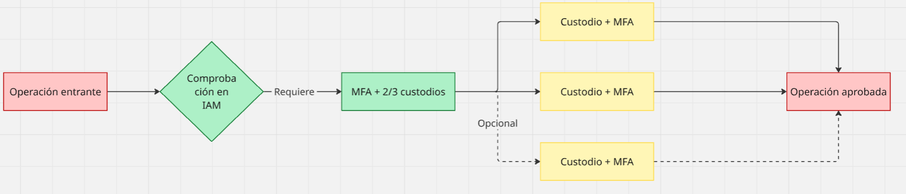

# Caso 3

# Group name - Jami Pura Vida
Marcelo Gomez
Isaac Rojas
Juan Carlos Valverde
Luis Masis

# Diseño de Llave Criptográfica Tripartita
Las llaves tripartitas en el contexto de este sistema van a ser de utilidad para proteger las claves criptográficas generadas distribuyendo una parte a Data Pura Vida y las otras dos a personas, entidades, etc. definidas por el usuario.

El sistema propuesto para implementar esta llave utiliza AWS KMS y CloudHSM para la administración de las claves simétricas y asimétricas creadas y el algoritmo [SSS](https://www.geeksforgeeks.org/shamirs-secret-sharing-algorithm-cryptography/) (Shamir's Secret Sharing) para la división e implementación de la llave, este algoritmo divide la clave en la cantidad de partes que se deseen (en este caso van a ser tres) y asegura que se necesiten al menos dos o incluso las tres partes para reconstruir la clave. En este caso se van a tener que utilizar dos partes por razones de redundancia.

El diagrama siguiente puede ayudar a entender el funcionamiento de esta llave de una mejor manera.

Las ventajas que proporciona el uso de esta llave es la mencionada redundancia ya que, si se pierde una parte, el sistema sigue funcionando y también mitiga riesgos de compromiso por una sola parte. Este sistema no asegura que exista complejidad en la gestión de las partes o que exista un riesgo de ataque si dos partes cometen un fallo o se ve violentada su seguridad (esto último podría evitarse obligando a ser necesarias las tres parte de la llave). 

# Aseguramiento del Cumplimiento Normativo y de Estándares
Para cumplir con los estándares internacionales y legislaciones nacionales, se propone la implementación de logs, de alertas obligatorias y de un mecanismo de auditoria para asegurar el apego a estos estándares y legislaciones.

### Estructura de logs 
Esta estructura de logs va a utilizar las tecnologías de AWS de CloudWatch (para el almacenamiento de los logs), AWS Kinesis Firehose (para la recopilación y análisis de datos en tiempo real), Lambda (para enriquecimiento de los logs) y opcionalmente S3 (por si se quiere un almacenamiento a largo plazo de los logs).

La estructura que van a seguir los logs a implementar es descrita en la siguiente tabla:

| Evento/s                                              | Campos del log                                             |        
|-------------------------------------------------------|------------------------------------------------------------| 
| Logins exitosos/fallidos, cambios de credenciales     | Timestamp, ID del usuario, método autenticación, resultado | 
| Acceso a Datos (Consultas, lecturas etc.)             | Timestamp, ID del usuario, dataset, campos accedidos       | 
| Creación/edición/eliminación de datos                 | Timestamp, ID del usuario, campo antes/después             |
| Intentos de vulneración, cambios de configuración     | Timestamp, IP, acción, sistema afectado                    |
| Consentimientos, solicitudes de ejerción  de derechos | Timestamp, ID del usuario, tipo solicitud, respuesta       |

### Mecanismos de Alerta Obligatorios
Las alertas estructuradas en la tabla siguiente van a ser utilizadas para mantener un mínimo de control sobre posibles acciones sospechosas que pueden ocurrir en el sistema:

| Detonante                      | Acción                            | Notificación | Tiempo de Respuesta |      
|--------------------------------|-----------------------------------|--------------|---------------------|  
| +3 intentos fallidos de acceso | Bloqueo temporal más notificación | SOC, CISO    | 15 minutos          |
|Acceso a >100 registros PII     | Revisión manual                   | DPO          | 24 horas            |  
|Modificación sin justificación  | Reversión automática              | Admins DB    | 30 minutos          |
|Patrón de acceso inusual        | Análisis comportamiento           | SIEM Team    | 1 hora              |
> SOC: Security Operations Center
> 
> CISO: Chief Information Security Officer
> 
> DPO: Data Protection Officer
> 
> SIEM: Security Information and Event Management 

> ** Estos roles y departamentos no exactamente pueden existir en data pura vida pero 

### Mecanismo de Auditoría
El mecanismo implementa AWS Config para detectar automáticamente configuraciones no compatibles, evaluar el cumplimiento de los múltiples estándares normativos que se tienen, generar evidencia auditable e implementar mecanismos de remediación automática (buscar detectar y solucionar problemas). También se implementa AWS Athena para reportes automáticos ya que esta herramienta es capaz de analizar grandes cantidades de datos con cierta facilidad y flexibilidad.

Aparte, este mecanismo contempla la retención de logs según su antigüedad con CloudWatch para retención de logs menores a 6 meses y S3 para los logs más antiguos e importantes.

<!-- Leyes/Estandares cumplidos
Ley 8968 (Art 16, Art 17, Art 19, Arts 21-30)
ISO 27001 (A.9.4.2, A.12.4.3, A.12.4)
GDPR (Art 5(2), Arts 15-22, Art 30, Art 35)
OECD Principle 8
NIST Cybersecurity Framework DE.CM-4 y DE.AE-3
PCI DSS Req 10
Ley 81 Art. 5
-->

# Restricción de Acceso Técnico a Datos Sensibles
Se debe garantizar que ningún personal técnico, de devops, ingeniero de datos etc. tenga ingreso a los datos sin una debida autorización, para eso se diseñó un sistema que combina 6 factores clave:
* **Cifrado de datos**
* **Control de acceso basado en atributos**
* **Proxy de datos seguros**
* **Elevación de privilegios Just-in-Time**
* **Segregación de ambientes**
* **Monitoreo y auditoría**
  
### Cifrado de Datos
El cifrado de datos fue detallado en una sección anterior, pero como resumen este... TBD

### Control de acceso basado en atributos
Este control obliga a que cada solicitud incluya MFA, justificación de acceso y roles de acceso específicos además de que los roles técnicos tienen explícitamente prohibido el acceso a datos planos.

### Proxy de datos seguros
Este intermediario cuenta con varias capas: capa de validación (verifica permisos y las solicitudes que entran), capa de transformación (aplica enmascaramiento y filtrado según criterios definidos) y capa de auditoría (registra cada operación antes de ejecutarla) y dentro de sus características claves es que este nunca expone conexiones directas y aplica reglas de minimización (muestra solo lo necesario).

### Elevación de privilegios Just-in-Time
Este factor contiene 4 pasos clave:
1. Solicitud: El técnico justifica la necesidad con ticket aprobado.

2. Aprobación: Requiere confirmación de un responsable.

3. Concesión: Credenciales temporales válidas por un límite de tiempo definido.

4. Monitoreo: Se extraen datos en tiempo real que son supervisados.

### Segregación de ambientes
Este factor cosiste en dividir el ambiente de trabajo en **ambiente de producción** donde el acceso es restringido y solo puede ser accedido mediante proxys, **ambiente de desarrollo** donde se tienen datos que son anonimizados además de redes aisladas con controles estrictos.

### Monitoreo y auditoría
Este factor cuenta con varias tecnologías de AWS GuardDuty y AWS Macie que detectan comportamientos anómalos e identifica exposición de datos sensibles.
