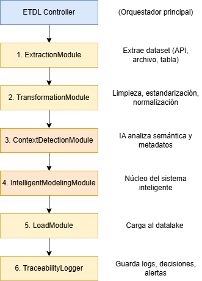

# *JAMI Pura Vida*

## Integrantes
Marcelo Gomez

Luis Masis

Isaac Rojas

Juan Carlos Valverde


# Introducción

La plataforma Data Pura Vida es una iniciativa diseñada para crear un ecosistema nacional de datos que permita a instituciones públicas, empresas privadas y ciudadanos compartir, acceder y utilizar información de manera fácil, segura y eficiente. Este documento describe la arquitectura técnica base del sistema, detallando sus componentes clave (como bases de datos, interfaces y protocolos de seguridad) y cómo estos se integran para garantizar que los datos sean interoperables (compatibles entre diferentes sistemas), protegidos contra riesgos y accesibles para quienes los necesiten. El objetivo es sentar las bases de una infraestructura que impulse la transparencia, la innovación y la toma de decisiones basada en evidencia, beneficiando a todo el país.

# Definición de la Arquitectura

## Objetivos de la Arquitectura

- Establecer una visión técnica clara para todos los actores involucrados.
- Asegurar escalabilidad, trazabilidad, seguridad y mantenibilidad desde el diseño.
- Definir los componentes principales del sistema y sus responsabilidades.
- Proveer una guía para futuras decisiones técnicas.

## Componentes principales

| Componente                             | Descripción                             |
|----------------------------------------|-----------------------------------------|
| Portal Web Público	                 | Interfaz de acceso para usuarios registrados y visitantes. Incluye módulos de registro, compra de datasets, dashboards e interacción con IA.|
| Capa de Autenticación	                 | Maneja verificación de identidad (biometría, MFA, IP), login y gestión de sesiones seguras.|
| Backend API                            | Expone lógica de negocio, procesamiento de datos, control de acceso, pagos, trazabilidad y manejo de usuarios.|
| Motor de Carga ETDL + IA	             | Ejecuta procesos de extracción, transformación, limpieza, modelado y carga usando IA para detectar errores, duplicados y relaciones entre datos.|
| Data Lake		                         | Almacenamiento de datasets estructurados y semiestructurados, versionados y cifrados.|
| Portal Administrativo (Backoffice)	 | Herramienta interna para operadores autorizados. Gestiona usuarios, roles, auditorías, monitoreo, llaves de seguridad y reportes.|
| Módulos de IA		                     | Ejecutan validación documental, prompting para visualizaciones inteligentes y sugerencias de uso de datasets.|
| Sistema de Seguridad	                 | Aplica cifrado en tránsito y en reposo, manejo de llaves (incluyendo llaves tripartitas) y control de accesos por roles y contexto.|

## Componentes Arquitectónicos y Tecnologías AWS Native Sugeridas

| Componente                             | Proposito                             | Tecnología Propuesta                  |
|----------------------------------------|---------------------------------------|---------------------------------------|
| Portal Web Público & Backoffice	     | Registro, dashboards, compra de datos, monitoreo | ReactJS + Tailwind CSS + Recharts + AWS Amplify |
| Capa de Autenticación    	             | Verificación biométrica, MFA, sesión segura | Amazon Cognito + JWT + AWS IAM + WAF |
| API Gateway	                         | Exposición controlada de servicios backend | Amazon API Gateway |
| Backend API                   	     | Procesamiento, control de acceso, pagos, auditoría | Node.js + TypeScript + Zod/Joi + AWS Lambda |
| Carga Inteligente (ETDL + IA) 	     | Limpieza, modelado, delta automático, duplicados | AWS Glue + Amazon Textract + Comprehend + SageMaker |
| Data Lake                     	     | Almacenamiento de archivos (CSV, JSON, Excel) | Amazon S3 + Glue Catalog + Lake Formation |
| Base de Datos Relacional      	     | Dashboards, usuarios, logs | Amazon Aurora Serverless v2 (opcional: DynamoDB para casos simples) |
| Base de Datos NoSQL           	     | Tokens, metadatos, control de límites | Amazon DynamoDB |
| Gestión de Seguridad           	     | Criptografía, llaves tripartitas, RBAC contextual | AWS KMS + Secrets Manager + GuardDuty + Security Hub |
| DevOps & QA                      	     | CI/CD, monitoreo, infraestructura como código | GitHub Actions + AWS CDK + CloudWatch + CloudTrail |
| Servicios Externos               	     | Notificaciones, pagos, correos | Stripe / BAC APIs + Twilio + Amazon SES |

## Diagrama de Contenedores


### Tecnologías sugeridas por contenedor

| Contenedor                             | Tecnologías sugeridas                   |
|----------------------------------------|-----------------------------------------|
| Portal Web	                         | React, Next.js, AWS Amplify             |
| API Gateway	                         | Amazon API Gateway                      |
| Backend API	                         | Node.js con NestJS / FastAPI / Spring Boot |
| Autenticación	                         | Amazon Cognito + MFA                    |
| ETDL + IA	                             | AWS Glue, Lambda, Textract, Comprehend  |
| Data Lake		                         | Amazon S3, Glue Catalog, Lake Formation, DynamoDB |
| Seguridad 	                         | AWS KMS, Secrets Manager, Shield, WAF   |
| Backoffice	                         | React + shadcn/ui + RBAC modular        |

## Riesgos técnicos iniciales identificados

1. Complejidad de integraciones entre componentes con IA
Mitigación propuesta: Diseñar APIs intermedias desacopladas

2. Manejo de llaves criptográficas tripartitas	
Mitigación propuesta: Uso de custodios distribuidos con mecanismo de quorum

3. Cumplimiento normativo y legal		
Mitigación propuesta: Integración temprana con asesoría legal para auditoría

4. Seguridad de datos en ambientes técnicos	
Mitigación propuesta: Políticas Zero Trust + cifrado forzado en todas las capas

# Modelo de Gobernanza de Seguridad y Accesos

1. Autenticación y verificación de identidad

| Elemento                               | Implementación propuesta                |
|----------------------------------------|-----------------------------------------|
| Registro inicial	                     | Validación con cédula, biometría, prueba de vida e IP de Costa Rica             |
| Login	                                 | Usuario + contraseña + Autenticación Multifactor (MFA)                      |
| Validación reforzada	                 | En caso de transacciones sensibles, requerir doble MFA o token por app |
| Identificación de dispositivos	     | Huella de navegador/IP, posibilidad de marcar IP como fija o temporal                   |

Tecnología recomendada: Amazon Cognito + AWS WAF para bloqueo por IP + Amazon GuardDuty para anomalías.

2. Modelo de Control de Acceso (RBAC + Contexto)

Definición de Roles Base:

| Rol                                    | Permisos principales               |
|----------------------------------------|-----------------------------------------|
| Usuario Básico	                     | Visualizar datasets públicos, gestionar perfil y crear dashboards personales.            |
| Proveedor de Datos	                 | Subir, editar y configurar datasets; definir reglas de acceso y monetización.                      |
| Comprador de Datos	                 | Acceder a datasets adquiridos, consumirlos vía dashboards, gestionar límites. |
| Administrador de Entidad	             | Gestionar organización, usuarios asociados, llaves y autorizaciones.                   |
| Auditor Interno       	             | Visualizar logs, métricas, y generar reportes de actividad por usuario.                   |
| Operador (Backoffice) 	             | Validar registros, gestionar flujos de carga, revisar accesos y generar reportes.                   |
| Superadmin del sistema	             | Control total: gestionar entidades, revocar accesos, regenerar llaves, visualizar todo.                   |

Contexto Adicional de Acceso:

| Contexto evaluado                      | Ejemplo de regla aplicada               |
|----------------------------------------|-----------------------------------------|
| Ubicación geográfica                   | Registro solo desde Costa Rica; acceso externo con IP declarada.            |
| Dispositivo / IP  	                 | Se restringe acceso a ciertas funciones desde IPs públicas o redes no confiables.       |
| Frecuencia de uso 	                 | Mecanismo de rate limiting si un usuario excede el uso permitido. |
| Tipo de operación     	             | Operaciones sensibles como descifrado requieren autenticación reforzada.                  |

Motor de políticas contextualizadas puede ser implementado con AWS Identity Center + reglas personalizadas vía Lambda.

3. Restricción de Accesos a Nivel de Datos
El modelo de seguridad incluye segmentación de acceso granular basada en entidad, usuario y nivel de autorización. Para garantizar un control completo sobre la visibilidad y trazabilidad de cada dataset, se definen campos mínimos obligatorios que deben estar presentes en todos los datasets cargados en la plataforma.

Campos requeridos en todos los datasets para aplicar reglas de gobernanza:

| Campo                      | Descripción               | Tipo de control asociado |
|----------------------------|---------------------------|--------------------------|
| organizacion_id            | Identificador único de la organización propietaria del dato  | Control de visibilidad por entidad (Row-Level Security) |
| user_id  	                 | Identificador del usuario que cargó o tiene permiso sobre el dato | Auditoría, filtrado por responsable, trazabilidad individual |
| share_id 	                 | Identificador del grupo o token de compartición (grupo de acceso compartido o modelo de monetización) | Control de compartición, licencias de acceso, métricas de uso compartido |

Estos campos deben ser incluidos en los metadatos del dataset y deben respetarse incluso si los datos están cifrados o seudonimizados.

Reglas aplicadas con estos campos:
-	Visualización controlada por organizacion_id: Un usuario solo puede consultar filas cuyo organizacion_id pertenezca a su entidad o esté explícitamente autorizado.
-	Filtrado por user_id en dashboards y reportes de actividad para mostrar solo datos subidos o autorizados por el usuario.
-	Permisos derivados de share_id permiten compartir datos entre organizaciones con control temporal, volumétrico o por frecuencia.

Ejemplo de política de acceso
```mysql
WHERE organizacion_id IN (autorizadas_por_usuario_actual)
  AND (share_id IS NULL OR share_id IN (tokens_autorizados))
```

## Diagrama de control de acceso por datos


4.  Llaves criptográficas y gobernanza de acceso

Tipos de Llaves:

| Tipo de Llave                          | Uso               |
|----------------------------------------|-----------------------------------------|
| Llave simétrica (AES)                  | Cifrado rápido de columnas de datos o archivos.            |
| Llave asimétrica (RSA)                 | Validación de autenticidad y firma de documentos.                     |
| Llave tripartita  	                 | Llave dividida en 3 partes. Se requieren 2 de 3 partes para uso. |

Gestión de Llaves Tripartitas
-	Se genera una llave única por organización.
-	Las tres partes se entregan a:
    o	La organización registrada
    o	El custodio técnico (puede ser Ministerio, Hacienda, etc.)
    o	La plataforma Data Pura Vida (bajo acceso controlado)
-	Uso requiere autorización múltiple (2 de 3).
-	Se usan módulos de seguridad de hardware (HSM) o servicios como AWS KMS Custom Key Store para proteger fragmentos.

5. Auditoría y monitoreo
-	Cada evento crítico (lectura, escritura, creación, descifrado, eliminación) se registra.
-	Se generan reportes de actividad por usuario, IP, entidad, dataset y acción.
-	Accesos a funciones restringidas quedan auditados con trazabilidad total.
-	Sistema de alertas por comportamiento sospechoso o intentos de acceso inválidos.

6. Matriz Roles y Permisos


7. Roles y Condiciones Contextuales


# Diseño de Infraestructura y Deploy Multinivel (Dev, QA, Prod)

## Entornos definidos

Se trabajará con tres entornos principales:

| Entorno                    | Propósito               | Visibilidad | Accesos |
|----------------------------|---------------------------|--------------------------|--------------------------|
| Desarrollo (Dev)           | Desarrollo activo, pruebas unitarias, prototipos.  | Interno (equipo técnico) | Acceso libre con auditoría |
| Calidad (QA) 	             | Pruebas funcionales, automatizadas y de integración. | Interno (QA y Dev) | Acceso validado por IP/MFA |
| Producción (Prod) 	     | Sistema en vivo operando para usuarios reales. | Externo (usuarios reales) | Acceso limitado y monitorizado |

## Diseño de Infraestructura por entorno
### Estructura común
Cada entorno tendrá su propia infraestructura separada:

| Componente | Tecnología / Propuesta |
|------------|----------------------|
| Microservicios / Contenedores | AWS ECS Fargate o EKS (Kubernetes) |
| Almacenamiento estático | Amazon S3 (carpetas separadas por entorno) |
| Bases de datos | Amazon RDS, con separación física y lógica |
| Datalake | Amazon S3 + Glue + Lake Formation |
| Backend API | API Gateway + Lambda o ECS Services |
| Autenticación y seguridad | Cognito, IAM Roles, WAF, Secrets Manager |
| Logs y auditoría | CloudWatch, CloudTrail, GuardDuty, Security Hub |

## Flujo de despliegue y promoción
### Pipeline de CI/CD

| Etapa | Acción |
|-------|---------|
| Commit | Desarrollador sube cambios |
| Build | Generación automática de contenedores / artefactos |
| Test en Dev | Pruebas unitarias e integración en entorno aislado |
| Deploy a QA | Validación funcional, automatizada y manual por QA |
| Deploy a Producción | Promoción con revisión manual, monitoreo activo |

Herramientas sugeridas: GitHub Actions / GitLab CI / AWS CodePipeline

### Control de versiones y trazabilidad
	
    Cada despliegue debe llevar:

-	Código hash o número de versión
-	Registro de cambios (changelog)
-	Validación previa en QA

	Todas las promociones se registran con trazabilidad completa.

### Control de acceso y seguridad    
| Capa | Medidas aplicadas |
|------|------------------|
| Dev | Acceso abierto para desarrolladores con logs |
| QA | Acceso controlado, datos sintéticos y cifrados |
| Producción | Acceso restringido, monitoreo y MFA obligatorio |
| Red | Control por listas blancas y segmentación de VPCs |
| Datos sensibles | Siempre cifrados en tránsito y reposo |

## Auditoría y monitoreo
-	Logs por entorno capturados vía CloudWatch + CloudTrail
-	Alertas configuradas en QA y Producción
-	Producción monitoreada con métricas clave:
o	Tiempo de respuesta
o	Errores
o	Uso de recursos
-	Seguridad reforzada en Producción con GuardDuty + Security Hub

## Diagrama del flujo CI/CD simplificado


## Configuración de Scripts de Deployment – GitHub Actions
Para cada entorno definido (Dev, QA, Producción), se emplearán pipelines automatizados de CI/CD mediante GitHub Actions. A continuación se describen los archivos base de configuración YAML utilizados para orquestar los despliegues por entorno.

1. Archivo: `.github/workflows/deploy-dev.yml`
- Ejecutado en push a rama `develop`
- Corre pruebas unitarias
- Despliega automáticamente a entorno Dev (ECS / Lambda)
- Incluye logging en CloudWatch y notificación opcional

2. Archivo: `.github/workflows/deploy-qa.yml`
- Ejecutado en push a rama `release/qa`
- Corre pruebas integradas y de regresión
- Despliega a entorno QA con validaciones predefinidas

3. Archivo: `.github/workflows/deploy-prod.yml`
- Ejecutado manualmente vía GitHub Actions
- Requiere aprobación (manual trigger)
- Despliega solo si QA fue exitoso
- Integra monitoreo con GuardDuty y CloudTrail post-deploy

Ejemplo de configuración mínima:

```yaml
name: Deploy to Dev
on:
  push:
    branches: [develop]
jobs:
  build-and-deploy:
    runs-on: ubuntu-latest
    steps:
    - uses: actions/checkout@v3
    - name: Set up Node.js
      uses: actions/setup-node@v3
      with:
        node-version: '18'
    - name: Install dependencies
      run: npm install
    - name: Run tests
      run: npm test
    - name: Deploy to AWS Lambda
      uses: appleboy/lambda-action@master
      with:
        aws_access_key_id: ${{ secrets.AWS_ACCESS_KEY_ID }}
        aws_secret_access_key: ${{ secrets.AWS_SECRET_ACCESS_KEY }}
        function_name: data-pura-vida-dev
        zip_file: dist/lambda.zip
```


# Diseño de Llave Criptográfica Tripartita
Las llaves tripartitas en el contexto de este sistema van a ser de utilidad para proteger las claves criptográficas generadas distribuyendo una parte a Data Pura Vida y las otras dos a personas, entidades, etc. definidas por el usuario.

El sistema propuesto para implementar esta llave utiliza AWS KMS y CloudHSM para la administración de las claves simétricas y asimétricas creadas y el algoritmo [SSS](https://www.geeksforgeeks.org/shamirs-secret-sharing-algorithm-cryptography/) (Shamir's Secret Sharing) para la división e implementación de la llave, este algoritmo divide la clave en la cantidad de partes que se deseen (en este caso van a ser tres) y asegura que se necesiten al menos dos o incluso las tres partes para reconstruir la clave. En este caso se van a tener que utilizar dos partes por razones de redundancia.

El diagrama siguiente puede ayudar a entender el funcionamiento de esta llave de una mejor manera.


Las ventajas que proporciona el uso de esta llave es la mencionada redundancia ya que, si se pierde una parte, el sistema sigue funcionando y también mitiga riesgos de compromiso por una sola parte. Este sistema no asegura que exista complejidad en la gestión de las partes o que exista un riesgo de ataque si dos partes cometen un fallo o se ve violentada su seguridad (esto último podría evitarse obligando a ser necesarias las tres parte de la llave). 

## Aseguramiento del Cumplimiento Normativo y de Estándares
Para cumplir con los estándares internacionales y legislaciones nacionales, se implementaron una serie de logs, alertas obligatorias y un mecanismo de auditoria para asegurar el apego a estos estándares y legislaciones.

### Estructura de logs 
Esta estructura de logs va a utilizar las tecnologías de AWS de CloudWatch (para el almacenamiento de los logs), AWS Kinesis Firehose (para la recopilación y análisis de datos en tiempo real), Lambda (para enriquecimiento de los logs con la [powertool](https://aws-amazon-com.translate.goog/blogs/opensource/simplifying-serverless-best-practices-with-lambda-powertools/?_x_tr_sl=en&_x_tr_tl=es&_x_tr_hl=es&_x_tr_pto=tc) *Logger*) y opcionalmente S3 (por si se quiere un almacenamiento a largo plazo de los logs).
La estructura de los logs a utilizar es la siguiente (estos campos cambian según el evento):

```python
log_entry = {
    'timestamp': datetime.datetime.utcnow().isoformat() + 'Z',
    'eventId': str(uuid.uuid4()),
    'userId': self._get_user_id(),
    'eventType': event_type,
    'sourceIP': self._get_ip(),
    'details': details,
    'complianceTags': self._get_compliance_tags(event_type)
}
```

Los eventos del sistema a registrar y los campos de este están descritos en la siguiente tabla:

| Evento/s                                              | Campos del log                                             |        
|-------------------------------------------------------|------------------------------------------------------------| 
| Logins exitosos/fallidos, cambios de credenciales     | Timestamp, ID del usuario, Tipo de evento, método autenticación, resultado | 
| Acceso a Datos (Consultas, lecturas etc.)             | Timestamp, ID del usuario, Tipo de evento, dataset, campos accedidos       | 
| Creación/edición/eliminación de datos                 | Timestamp, ID del usuario, Tipo de evento, campo antes/después             |
| Intentos de vulneración, cambios de configuración     | Timestamp, IP, Tipo de evento, acción, sistema afectado                    |
| Consentimientos, solicitudes de ejerción de derechos | Timestamp, ID del usuario, Tipo de evento, tipo solicitud, respuesta       |

### Mecanismos de Alerta Obligatorios
Las alertas estructuradas en la tabla siguiente van a ser utilizadas para mantener un mínimo de control sobre posibles acciones sospechosas que pueden ocurrir en el sistema:

| Detonante                      | Acción                            | Tiempo de respuesta máximo|      
|--------------------------------|-----------------------------------|---------------------|  
| +3 intentos fallidos de acceso | Bloqueo temporal más notificación | 15 minutos          |
|Acceso a >100 registros PII     | Revisión manual                   | 24 horas            |  
|Modificación sin justificación  | Reversión automática              | 30 minutos          |
|Patrón de acceso inusual        | Análisis comportamiento           | 1 hora              |

Estas alertas usan la powertool *Metrics* de Lambda para crear la alerta cuando el detonante ocurre haciendo llegar esta o estas a la persona o equipo encargado de la seguridad.

### Mecanismo de Auditoría
El mecanismo implementa AWS Config para detectar automáticamente configuraciones no compatibles, evaluar el cumplimiento de los múltiples estándares normativos que se tienen, generar evidencia auditable e implementar mecanismos de remediación automática (buscar detectar y solucionar problemas). También se implementa AWS Athena para reportes automáticos ya que esta herramienta es capaz de analizar grandes cantidades de datos con cierta facilidad y flexibilidad.

Aparte, este mecanismo contempla la retención de logs según su antigüedad con CloudWatch para retención de logs menores a 6 meses y S3 para los logs más antiguos e importantes.


<!-- Leyes/Estandares cumplidos
Ley 8968 (Art 16, Art 17, Art 19, Arts 21-30)
ISO 27001 (A.9.4.2, A.12.4.3, A.12.4)
GDPR (Art 5(2), Arts 15-22, Art 30, Art 35)
OECD Principle 8
NIST Cybersecurity Framework DE.CM-4 y DE.AE-3
PCI DSS Req 10
Ley 81 Art. 5
-->
-->

## Restricción de Acceso Técnico a Datos Sensibles
Se debe garantizar que ningún personal técnico, de devops, ingeniero de datos etc. tenga ingreso a los datos sin una debida autorización, para eso se diseñó un sistema que combina 6 factores clave:
* **Cifrado de datos**
* **Control de acceso basado en atributos**
* **Proxy de datos seguros**
* **Elevación de privilegios Just-in-Time**
* **Segregación de ambientes**
* **Monitoreo y auditoría**
  
### Cifrado de Datos
El cifrado de datos fue detallado en una sección anterior, pero como resumen este... TBD (esperando a que esa sección este hecha en su completitud)

### Control de acceso basado en atributos
Este control utiliza IAM para crear políticas para restringir estrictamente el acceso a los datos en el data lake si no se cumplen unas ciertas condiciones. La política es de tipo "Deny" lo que significa que explícitamente niega ciertas acciones a menos que se cumplan todas las condiciones especificadas. Las condiciones a cumplir en este control son las de restricción geográfica es decir que solo se pueden realizar operaciones dentro del país, que el usuario este autenticado con MFA y que el usuario posee una etiqueta especifica que otorgue acceso y coincida con su ARN (identificador único del usuario).

Estas políticas pueden verse de esta manera mediante configuraciones de AWS IAM como la siguiente:

```python
abac_policy = {
    "Version": "2025-XX-XX",
    "Statement": [
        {
            "Effect": "Deny",
            "Action": [
                "s3:GetObject",
                "glue:GetTable",
                "athena:GetQueryResults"
            ],
            "Resource": "*",
            "Condition": {
                "NotIpAddress": {
                    "aws:SourceIp": [
                        "190.57.0.0/16",  # Rango principal de Costa Rica
                        "201.222.0.0/16", 
                        "200.107.0.0/16"  
                    ]
                }
                "Null": {
                    "aws:MultiFactorAuthPresent": "false"
                },
                "ForAnyValue:StringNotLike": {
                    "aws:PrincipalTag/DataAccess": "${aws:PrincipalArn}"
                }
            }
        }
    ]
}
```

### Proxy de datos seguros
Este componente va a actuar como un intermediario entre el sistema y el datalake, cuenta con varias capas que realizan cada una su función: capa de validación (verifica permisos y las solicitudes que entran), capa de transformación (aplica enmascaramiento y filtrado según criterios definidos) y capa de auditoría (registra cada operación antes de ejecutarla) y dentro de sus características claves es que este nunca expone conexiones directas y aplica reglas de minimización (muestra solo lo necesario).

### Elevación de privilegios Just-in-Time
Este factor utiliza AWS Security Token Service (AWS STS) para crear credenciales temporales con privilegios específicos contiene 4 pasos clave:
1. Solicitud: El técnico justifica la necesidad con ticket aprobado (esto se hace fuera del factor, por ejemplo, mediante la creación de un ticket solicitando acceso).

2. Aprobación: Requiere confirmación de un responsable.

3. Concesión: Credenciales temporales válidas por un límite de tiempo definido.

4. Monitoreo: Se extraen datos en tiempo real que son supervisados.
Ejemplos de cómo crear este componente se pueden encontrar en la [documentación oficial de AWS STS.](https://docs.aws.amazon.com/es_es/IAM/latest/UserGuide/service_code_examples_sts.html)

### Segregación de ambientes
Este factor cosiste en dividir el ambiente de trabajo en **ambiente de producción** donde el acceso es restringido y solo puede ser accedido mediante proxys, **ambiente de desarrollo** donde se tienen datos que son anonimizados además de redes aisladas con controles estrictos.

### Monitoreo y auditoría
Este factor cuenta con las tecnología de AWS GuardDuty que va a ser usado como detector de amenazas, este analiza en segundo plano patrones de acceso a datalake, llamadas a APIs inusuales o comportamientos extraños de roles. Cuando ocurre un evento sospechoso notifica al equipo de seguridad y registra el incidente para investigación, también es importante tener en cuenta que estas respuestas se podrían automatizar con Lambda y demás.

También se tiene en cuenta la tecnología de AWS Macie que va a servir para descubrir automáticamente datos sensibles y alertar sobre posibles exposiciones de datos críticos, esto se logra mediante jobs como por ejemplo el que se encuentra aquí abajo el cual es encargado de detectar formatos como: cédulas, tarjetas crédito, emails, etc.

```python
macie.create_classification_job(
    jobType='SCHEDULED', # También puede ser 'ONE_TIME'
    name='DPVida-Data-Classification',
    s3JobDefinition={
        'bucketDefinitions': [
            {
                'accountId': '123456789012',
                'buckets': ['dpvida-prod-data']
            }
        ],
        'scoping': {
            'excludes': {
                'and': [
                    {
                        'tagScopeTerm': {
                            'tagKey': 'DataClassification',
                            'tagValues': ['Public'] #Omite datos marcados como públicos
                        }
                    }
                ]
            }
        }
    }
)
```

# Sistema de Métricas, Consumo y Alertas
El sistema de módulos planteados a continuación busca proporcionar una visión completa del sistema comenzando por la métricas más críticas con la posibilidad de agregar las que se necesiten según se considere necesario. 

Dentro de las especificaciones técnicas dentro del sistema se encuentra la frecuencia de muestreo se tienen 15 segundos para las métricas clave, 1 minuto para demás métricas operacionales y 1 hora para los historiales. En materia de retención de datos se van a tener los datos más actuales a 7 días de su extracción, los de corto plazo a 30 días y los de largo plazo de estos 30 días en adelante. Se pueden tomar en cuenta otros módulos como módulos para la gestión del ciclo de vida de los datos o para seguridad, pero estos no van a ser explicados en detalle.

Los módulos claves del sistema son los siguientes:

## 1. Módulos de Recolección de Métricas

### 1.1. Módulo de Telemetría de Datos
Este módulo es el encargado de recoger métricas como el volumen de datos procesados (GB/día), tasa de transferencia (MB/seg), latencia en pipelines de ETL y los tiempos de respuesta por API. Esto es posible mediante AWS CloudWatch con Prometheus.

### 1.2. Módulo de Auditoría de Accesos
Este módulo recoge datos y métricas como intentos de acceso fallidos, patrones de consulta sospechosos y uso de credenciales temporales esto mediante tecnologías como AWS CloudTrail.

## 2. Módulos de Procesamiento y Análisis

### 2.1. Módulo de Detección de Anomalías
Este módulo es el encargado de seguir que se siga el "comportamiento normal" modelado y de alertar en tiempo real las desviaciones esto a gracias a Amazon Lookout for Metrics que detecta anomalías en métricas e identifica su causa de manera automática.

### 2.2. Módulo de Rendimiento Operativo
Este módulo consiste en desbordas de métricas como disponibilidad del sistema (uptime), capacidad de almacenamiento utilizada y rendimiento de consultas. Estos dashboards pueden ser fácilmente implementados usando plantillas o creándolos desde cero con tecnologías como Grafana o AWS QuickSight

## 3. Módulos de Visualización y Alertas
Este módulo va a contar con ciertos dashboards, widgets, gráficos etc. que van a servir para visualizar la salud del sistema, monitorear el uso de recursos y crear alertas si se presenta un problema de seguridad.
_______________________________________________________________

## Control de Versiones y Deltas para Cada Dataset

A medida que la plataforma *JAMI Pura Vida* recibe más y más datasets, es importante tener una estrategia clara para controlar sus versiones, ahorrar espacio y mantener la trazabilidad de todo lo que ocurre con los datos.

Esta tarea tiene como objetivo definir cómo vamos a manejar las diferentes versiones de un mismo dataset, y cómo registrar solamente los cambios (deltas) que ocurren entre una versión y otra. De esta forma evitamos almacenar archivos completos cada vez que se actualiza algo, lo que nos ayuda a reducir el espacio utilizado, pero sin perder el historial de los datos.

Además, todo este proceso debe quedar bien documentado, de modo que siempre podamos saber qué versión se usó, qué cambió, quién hizo el cambio (si aplica), y cuándo.

### Propuesta de solución

La idea es trabajar con un modelo mixto que combine:

1.	 Snapshots o versiones completas del dataset (cuando se crea por primera vez o cada cierto tiempo), y

2. Archivos delta, que registran únicamente lo que cambió entre una versión y otra (por ejemplo: datos nuevos, editados o eliminados).

### Manejo de versiones

Cada vez que se sube un dataset por primera vez, se guarda como una versión completa. A partir de ahí, se puede trabajar con cargas incrementales, donde solo se guarda lo que cambió desde la última versión.

Para organizarlas, se pueden usar carpetas dentro de S3 con nombres que indiquen la versión o la fecha:

```sh
/dataset=usuarios/version=2025-02-03/
/dataset=usuarios/version=2025-05-06-delta/
```

Para llevar un control claro de cada versión o delta que se cargue en el sistema, se usará una tabla llamada DatasetVersionLog, donde se registra todo lo relacionado con esa versión: qué tipo fue, cuántos registros tiene, quién la cargó, si hubo errores, la ruta del archivo en S3, etc.

Esta tabla nos permite reconstruir la historia completa de cualquier dataset, detectar errores rápidamente, y tener trazabilidad tanto técnica como legal si es necesario. Se va a guardar un registro por cada carga que se haga (ya sea una versión completa o un delta), con información clave para identificar qué cambió, cuándo y en qué condiciones.

### Estructura de la tabla DatasetVersionLog

| Columna           | Tipo de Dato           | Descripción                      |
|-----------------|----------------|---------------------------------------|
| dataset_id | String | Nombre o identificador del dataset afectado (ej: empleados, salud_poblacional). |
| version_id | String (fecha o UUID) | Identificador único de la versión (ej: 2024-06-01, 20240605-delta). |
| version_type | String | "snapshot" o "delta", según el tipo de carga. |
| timestamp | Datetime | Fecha y hora en que se cargó esa versión. |
| operation_type | String | "insert", "update", "delete" o "mixed". |
| record_count | Int | Cantidad de registros procesados en esta versión. |
| executed_by | String | Usuario, sistema o proceso que hizo la carga. |
| surce_file_path | String | Ruta del archivo en S3 asociado a la versión. |
| hash | String (SHA256) | Hash del archivo para validar integridad. |
| status | String | "success", "error" o "partial". |
| error_messagge (opcional) | String | Mensaje de error si la carga falló. |
| notes (opcional) | String | Campo libre para comentarios adicionales. |

### ¿Cómo se detectan los deltas?

La detección de cambios se puede hacer de dos formas:

a) Usando columnas de control

Cada dataset puede tener campos como:

- last_updated_timestamp: para saber si un registro fue actualizado.
- operation_type: para saber si fue un insert, update o delete.

b) Comparando versiones

Si el dataset no trae esas columnas, se puede comparar la nueva versión contra la anterior, y ver:

-	Qué registros aparecen nuevos.
-	Cuáles tienen diferencias.
-	Cuáles ya no están.

Esto se puede automatizar con herramientas como AWS Glue, que permite comparar datos con scripts, o incluso con consultas en Redshift si los datasets están registrados.

### Aplicación de cambios (merge)

Una vez identificados los cambios, se aplican al dataset principal, por ejemplo con un comando `MERGE INTO`, que:

-	Inserta los registros nuevos.
-	Actualiza los que cambiaron.
-	Elimina los que ya no deberían estar.

Este proceso mantiene la integridad de los datos y evita duplicaciones o errores por cargas repetidas.


### Diagrama de flujo


 
### Trazabilidad y registros

Para mantener un buen control de todo el proceso, se pueden registrar los siguientes datos por versión:

- Fecha de carga.
-	Hash del archivo.
-	Registros totales.
-	Tipo de operación (completa o delta).
-	Resultado del procesamiento (exitoso o con errores).

Esta información se puede guardar en una tabla en `DynamoDB` o en archivos en `S3`, y los logs del proceso se pueden enviar a `CloudWatch`.

### Puntos altos de este enfoque

-	Ahorra espacio porque no se guardan archivos completos innecesarios.
-	Mejora el rendimiento al trabajar con datos más livianos.
-	Mantiene trazabilidad, ya que se puede reconstruir cualquier versión del dataset si es necesario.
- Facilita auditorías y debugging.

_______________________________________________

## Definición del Motor de Carga ETDL Inteligente con IA

Para manejar de forma eficiente los distintos datasets que ingresan a la plataforma *JAMI Pura Vida*, se propone el diseño de un motor ETDL inteligente que permita no solo cargar los datos, sino también asegurar su calidad, contexto y trazabilidad.

Este motor sigue una estructura modular con etapas de extracción, transformación, detección de contexto y modelado, integrando IA para analizar los metadatos y el contenido de los datos. Como parte central del diseño, se incorpora el patrón Reactivo, que permite que el sistema detecte y reaccione automáticamente ante nuevos datasets, rediseñando el modelo de datos cuando sea necesario.

El objetivo es reducir al mínimo las intervenciones manuales, aprovechar la inteligencia artificial para tomar decisiones sobre el esquema de datos, y mantener siempre un registro claro de todo lo que ocurre en el proceso.

### Objetivo general de esta nueva tarea

Diseñar los módulos y el flujo del motor ETDL inteligente con IA, asegurando calidad de datos (consistencia, completitud, limpieza), trazabilidad (saber qué se hizo, cuándo y por qué) y aprovechar IA para decisiones automáticas durante el modelado.

### Estructura general del Motor ETDL Inteligente



#### 1. ExtractionModule

Se encarga de recibir datasets desde múltiples fuentes (archivos, APIs, bases de datos). Su función es desacoplar la ingesta del resto del flujo, y garantizar que los datos lleguen completos.

Tecnologías: Amazon S3, AWS Glue, AWS DMS.

#### 2. TransformationModule

Aquí se ejecutan las tareas tradicionales de limpieza y transformación: validación de tipos, eliminación de duplicados, estandarización de formatos, y normalización de campos. Este paso garantiza calidad básica antes de pasar a IA.

Tecnologías: AWS Glue, AWS Lambda.

#### 3. ContextDetectionModule

Este módulo utiliza IA para identificar el contexto semántico de los datos. Analiza nombres de columnas, metadatos, ejemplos de valores y estructuras comunes. Sirve como base para el modelado inteligente.

Tecnologías: Amazon Comprehend, Textract.

#### 4. IntelligentModelingModule

Es el núcleo del sistema inteligente. Reacciona ante nuevos datasets y, con ayuda del LLM, detecta si deben fusionarse, vincularse, renombrarse o generar relaciones con datos existentes. Utiliza el patrón Reactivo porque responde a cambios en el estado del datalake sin intervención manual.

#### Metáfora del mundo real del patrón

Sistema inmunológico humano

Así como el cuerpo humano detecta cambios en su entorno interno (virus, bacterias) y reacciona automáticamente activando defensas, el patrón reactivo en este sistema actúa ante la llegada de nuevos datasets, analiza sus características y toma acciones inmediatas como:

-	Reorganizar relaciones entre datos existentes.
-	Unir datasets que tienen campos comunes (como si detectara ADN similar).
-	Agregar columnas donde se necesitan más detalles.
-	Optimizar el modelo actual de forma automática sin intervención manual.

#### Explicación funcional del Reactive Pattern en este caso

El agente reactivo:

1.	Espera pasivamente a que nuevos datasets ingresen al datalake.

2.	Reacciona inmediatamente al evento de inserción mediante un pipeline automático.

3.	Utiliza metadatos y análisis semántico del contenido para decidir:

    -	Si debe hacer merge entre datasets.
    -	Si hay columnas que deben unirse o renombrarse.
    -	Si se deben establecer relaciones y generar llaves foráneas.
    -	Si deben crearse índices o transformar el modelo de datos existente.

4.	Aplica las transformaciones y reestructura el esquema sin intervención humana directa.

#### Diagrama del patrón reactivo personalizado


#### Componentes del patrón

| Componente     | Función      | 
|----------------------|----------------|
| DatasetListener | Detecta la llegada de nuevos datasets en S3/Glue |
| SchemaAnalyzer | Extrae y analiza los metadatos + semántica de columnas |
| AIReactor (LLM Handler) | Consulta al LLM o motor IA con prompt estructurado |
| SchemaRewriter | Aplica cambios al modelo de datos |
| ModelStore | Registra la nueva versión del modelo optimizado |
| ActionLogger | Guarda todas las decisiones y transformaciones para trazabilidad |

#### Inputs

-	Dataset cargado (Excel, CSV, JSON)
-	Metadatos declarados (tipo de columnas, relaciones sugeridas)
-	Historial de datasets existentes

#### Result Output

-	Modelo de datos transformado: actualizado, optimizado, versionado
-	Acciones registradas en logs (para auditoría y reversión)
-	Nuevas relaciones entre datasets reflejadas en Glue Catalog o Redshift

#### Interacción con el LLM / Servicio de IA

Ocurre dentro del componente AIReactor, que genera prompts con la siguiente estructura:

```sh
"Recibiste un nuevo dataset con las siguientes columnas: [...]. 
Ya existen otros datasets con columnas similares: [...]. 
Analiza si debe realizarse un merge, agregar columnas, renombrar, 
crear relaciones o índices. Responde con acciones estructuradas."
```

Este componente puede usar Amazon Bedrock o SageMaker Endpoint personalizado si se entrena un modelo propio.

#### 5. LoadModule

Solo si el modelado fue exitoso, los datos se cargan al datalake (Data Lake formal) usando los esquemas actualizados. Esta operación puede incluir escritura en formato columnar, compresión, y control de versiones.

Tecnologías: Amazon S3, AWS Glue, Redshift (opcional).

#### 6. TraceabilityLogger

Se encarga de registrar todo lo que sucede: desde el origen del dataset, hasta cada transformación y decisión tomada por el LLM. Provee trazabilidad completa para auditoría, debugging y control de calidad.

Tecnologías: AWS CloudWatch Logs, DynamoDB.
_________________________________________________________________

## Arquitectura del Motor de Prompts para Consultas Inteligentes

Uno de los objetivos más innovadores del proyecto *JAMI Pura Vida* es permitir a los usuarios consultar datos por medio de lenguaje natural, sin necesidad de escribir código o armar consultas técnicas.

Para eso, se plantea el diseño de un motor de prompts, que sirva como puente entre lo que el usuario pide con sus palabras y las visualizaciones que necesita ver. Es decir, un sistema capaz de traducir una pregunta como “Mostrame el crecimiento mensual de nuevas empresas registradas en el GAM” en un dashboard generado automáticamente, respetando siempre los permisos de acceso que tenga ese usuario.

Este motor debe ser flexible, seguro y capaz de conectarse a la base de datos o datalake según corresponda, procesar la información, y generar visualizaciones que respondan directamente al prompt.

### Arquitectura general del Motor de Prompts

El motor está compuesto por distintos módulos que trabajan juntos para convertir un prompt en una visualización válida y útil:


 
Se va a implementar un patrón de agentes, en este caso el Patrón Planner-Executor. Este patrón se utiliza dando un enfoque en donde las tareas complejas se dividen en dos etapas claras; **planificación y ejecución**.

En el contexto de *JAMI Pura Vida*, el patrón Planner-Executor permite que el motor de prompts reciba una consulta en lenguaje natural, genere un plan seguro y autorizado (planning), y luego lo convierta en una visualización útil, cumpliendo con las reglas de seguridad y acceso definidas (execution).

### 1. PromptAgent (Agente coordinador)

Es el núcleo del motor. Es quien recibe el prompt del usuario y coordina todo lo que pasa después. No interpreta el prompt directamente, pero sabe a quién debe enviárselo y en qué orden deben ejecutarse los pasos. También es responsable de enviarle al usuario la visualización final.

Ejemplo:
 Recibe el mensaje:

 ```sh
 “Quiero ver el crecimiento mensual de empresas en Heredia”.
```

→ Llama al PromptPlanner, después al SecurityValidator, luego al QueryExecutor, etc.

### 2. PromptPlanner (Planificador del prompt)

Este componente lee el texto del usuario e interpreta su intención. Su trabajo es convertir el lenguaje natural en un “plan de acción”, que normalmente incluye:

•	Qué datos buscar.

•	Qué filtros aplicar (ej. región, fechas).

•	Qué métrica usar (ej. conteo, promedio).

•	Qué tipo de visualización puede representar mejor ese resultado.


El PromptPlanner puede generar un plan tipo:

```sh
{
  "dataset": "empresas",
  "filtro": "provincia = 'Heredia'",
  "agrupado_por": "mes",
  "métrica": "cantidad_registros",
  "visualización": "gráfico de líneas"
}
```

### 3. SecurityValidator (Validador de seguridad y permisos)

Antes de ejecutar cualquier consulta, el plan debe pasar por una validación de seguridad. Este módulo:

•	Verifica si el usuario tiene acceso al dataset solicitado.

•	Revisa si los filtros (por región, institución o nivel de detalle) son válidos.

•	Bloquea o ajusta el plan si hay riesgos (por ejemplo, datos sensibles, columnas restringidas).


Ejemplo:

 Un ciudadano pide ver “datos individuales de ingresos”.
 
 → El SecurityValidator detecta que eso no está permitido y modifica el plan para mostrar solamente promedios agrupados.
 
### 4. QueryExecutor (Ejecutor de consulta)

Este componente transforma el plan aprobado en una consulta real (por ejemplo, SQL o consulta en Athena), la ejecuta y devuelve los resultados.

•	Si hay errores en la ejecución, los reporta.

•	Si hay mucha información, puede aplicar paginación o resumir.

•	Se conecta a las fuentes: S3, Redshift, DynamoDB, etc.


Ejemplo:

 A partir del plan, genera esta consulta:

```sh 
SELECT mes, COUNT(*) as total
FROM empresas
WHERE provincia = 'Heredia'
GROUP BY mes
ORDER BY mes ASC;
```

### 5. VisualizationBuilder (Constructor de visualización)

Toma los resultados crudos (tabla, números, agrupaciones) y decide automáticamente qué tipo de gráfico o componente visual mostrar al usuario.

•	Usa lógica basada en el tipo de dato (tiempo, categorías, números).

•	Puede generar gráficos de líneas, barras, tortas, tablas ordenadas, mapas, etc.

•	Se asegura de que la visualización sea clara, útil y entendible.


Ejemplo:

 Si los datos tienen fechas en orden, genera un gráfico de líneas.
 
 Si hay categorías, genera barras o torta.

### 6. PromptResponseEngine (Motor de respuesta)

Este módulo empaqueta todo el resultado (visualización, metadatos, contexto) y lo entrega al usuario, normalmente dentro de la interfaz de la aplicación.

•	También puede incluir la explicación de qué datos se usaron, de qué fuente, y cómo se calculó el resultado.

•	Si hubo ajustes en el prompt por seguridad, puede informarle al usuario.


Ejemplo:

 El usuario pidió algo y se devuelve:

```sh 
"Gráfico generado con datos de empresas registradas en Heredia, agrupadas por mes. Última actualización: mayo 2024."
```

### Seguridad y control de accesos

Uno de los aspectos más importantes en un sistema que permite acceder a datos mediante lenguaje natural es asegurarse de que cada usuario solo vea lo que le corresponde, sin importar qué tan específica o ambigua sea la consulta que haga.

El motor de prompts implementa seguridad en distintos niveles:

1.	Validación por rol y perfil: Antes de ejecutar cualquier consulta, se consulta el rol del usuario (por ejemplo: ciudadano, analista, institución pública) y se define qué datasets puede ver, qué columnas están disponibles y a qué nivel de detalle puede acceder.


2.	Catálogo de datos controlado: El modelo de lenguaje no tiene acceso libre a todas las tablas. Solo puede trabajar con un catálogo de datos documentado, que define qué columnas y tablas están disponibles para cada tipo de usuario.


3.	Filtrado automático según contexto: Incluso si un usuario puede acceder a un dataset, el sistema puede aplicar automáticamente filtros adicionales (como restringirlo a su provincia, cantón o institución) para respetar las políticas internas de acceso.


4.	Auditoría y trazabilidad: Cada prompt, consulta generada y respuesta visual se registra con metadatos como usuario, fecha, origen, tipo de acceso y resultado. Esto permite revisar o auditar cualquier consulta posterior.


5.	Bloqueo y reformulación de prompts sensibles: Si un prompt intenta acceder a datos restringidos (por ejemplo: “mostrame ingresos por persona en mi distrito”), el sistema puede reformular automáticamente la consulta o negarla, manteniendo siempre la trazabilidad del intento.

# Arquitectura del Portal de BackOffice

## Funciones clave del portal

| Funcionalidad             | Descripción                                                                 |
|--------------------------|------------------------------------------------------------------------------|
| Gestión de registros     | Validar o rechazar solicitudes de registro de usuarios y entidades.         |
| Gestión de llaves        | Generar, dividir, revocar o reasignar llaves simétricas, asimétricas y tripartitas. |
| Monitoreo de cargas      | Visualizar flujos de datos, estados, errores, volumen y métricas de integridad. |
| Auditoría de operaciones | Consultar logs detallados de quién hizo qué, cuándo y con qué efecto.       |
| Reversibilidad           | Permitir anular, revertir o rehacer acciones críticas si se justifica.      |
| Gestión de roles y permisos | Asignar perfiles a operadores, definir visibilidad y niveles de aprobación. |
| Generación de reportes   | Crear reportes detallados para análisis técnico o cumplimiento normativo.   |

---

## Arquitectura del sistema

### Componentes principales

| Componente         | Descripción técnica                                                               |
|--------------------|------------------------------------------------------------------------------------|
| Autenticación      | Integración con Amazon Cognito (MFA + RBAC)                                       |
| Backend API        | Exposición de servicios administrativos vía endpoints protegidos (REST o GraphQL) |
| Base de Datos      | PostgreSQL o DynamoDB con acceso segmentado por tipo de acción                    |
| Registro de logs   | CloudWatch Logs + CloudTrail para auditoría interna                               |
| Orquestación       | Lambda Functions o microservicios para tareas reversibles o asíncronas            |
| Panel de métricas  | Dashboards internos con métricas (CloudWatch, Prometheus, Grafana si aplica)     |


## Control de acceso (RBAC)

| Rol del operador        | Permisos asignados                                                               |
|-------------------------|----------------------------------------------------------------------------------|
| Validador               | Aprobar/rechazar registros nuevos                                                |
| Administrador de llaves | Gestionar llaves, ver custodios, auditar firmas                                 |
| Auditor                 | Consultar logs, generar reportes de actividad                                    |
| Supervisor              | Editar configuraciones, activar/desactivar flujos de integración                 |
| Superadmin              | Ver y hacer todo; incluido revertir operaciones pasadas                          |

Los permisos están jerarquizados y condicionados al contexto de cada entidad (ej: solo puedo ver datos de mi jurisdicción).


## Reversibilidad y control de errores

- Toda acción crítica tendrá una referencia de operación única.
- Se registrarán acciones con:
  - Quién la ejecutó
  - Fecha y hora exacta
  - Resultado del proceso
- Las operaciones reversibles deben:
  - Tener lógica de deshacer (rollback, soft delete, estado anterior)
  - Contar con confirmación de 2 operadores o autorización de un supervisor

### Diseño de la Bitácora de Reversibilidad y Control de Errores

| Campo                    | Tipo de dato             | Descripción                                                                 |
|--------------------------|--------------------------|-----------------------------------------------------------------------------|
| `operation_id`           | UUID / Texto             | Identificador único de la operación.                                        |
| `timestamp`              | FechaHora (ISO 8601)     | Fecha y hora exacta en que se ejecutó la operación.                         |
| `executed_by_user_id`    | Texto / UUID             | ID del usuario que ejecutó la acción.                                       |
| `user_role`              | Texto                    | Rol del usuario al momento de la acción.                                    |
| `user_ip`                | IP (Texto)               | Dirección IP desde la cual se ejecutó la operación.                         |
| `entity_context`         | Texto                    | Entidad u organización asociada al contexto de la acción.                   |
| `operation_type`         | Enum                     | Tipo de acción (CREATE, UPDATE, DELETE, REVERT, APPROVE, REJECT).           |
| `operation_target`       | Texto                    | Objeto afectado (usuario, dataset, llave, configuración, etc.).             |
| `target_id`              | Texto / UUID             | ID o referencia del objeto afectado.                                        |
| `previous_state`         | JSON (opcional)          | Estado anterior al cambio (para permitir reversión).                        |
| `new_state`              | JSON (opcional)          | Estado posterior al cambio.                                                 |
| `is_reversible`          | Booleano                 | Indica si la operación puede revertirse.                                    |
| `reversal_token`         | UUID / Texto (opcional)  | Token para reversión, si aplica.                                            |
| `reversed_by_user_id`    | Texto / UUID (opcional)  | Usuario que realizó la reversión (si ocurrió).                              |
| `reversed_timestamp`     | FechaHora (opcional)     | Fecha y hora en que se revirtió la operación.                               |
| `requires_supervisor_auth`| Booleano                | Si requiere doble validación o autorización de supervisor.                  |
| `reason_or_comment`      | Texto                    | Motivo u observación registrada por el operador.                            |
| `status`                 | Enum                     | Estado final de la operación (SUCCESS, FAILED, REVERTED, PENDING).          |
| `audit_signature`        | Texto (hash o firma)     | Firma digital para asegurar la integridad del registro.                     |

## Auditoría y trazabilidad

- Logs almacenados con nivel de detalle:
  - Usuario, IP, acción, resultado, motivo
- Todas las operaciones serán auditables vía filtros por fecha, tipo y resultado.
- Se rastrearán cambios de configuración, llaves, permisos y accesos.
- Los logs se podrán visualizar desde el portal y exportar con autorización.
- Los reportes de trazabilidad podrán descargarse en formato PDF o CSV con firma digital.

## Diagrama Arquitectura Portal Backoffice

