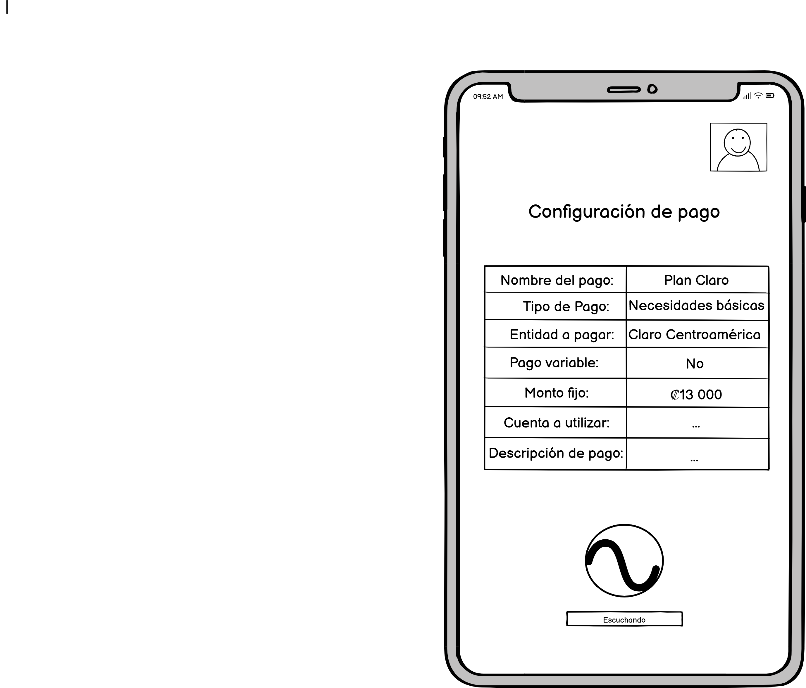
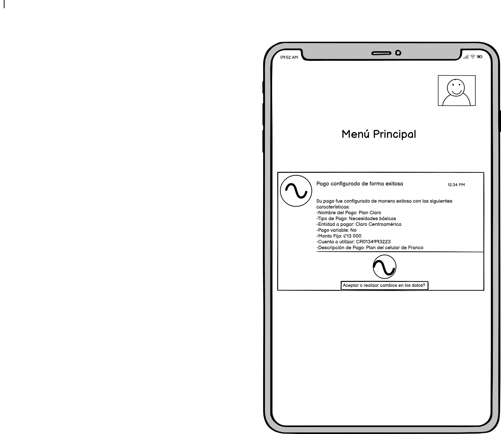

# Caso 1 - Segundo Entregable

## Investigación sobre el GoalMap.

#### Durante la investigación del GoalMap tomando en cuenta las metodologías de Google Sprint y Design Thinking encontramos diversos textos en los que se explican estas metodologías como procesos que ayudan a los equipos de trabajo a dar una respuesta a preguntas que tienen una gran relevancia a través de prototipos que se le muestran al cliente con el objetivo de obtener ideas más claras y aprobación a soluciones.

#### Posteriormente, buscando ejemplos de como exactamente se puede realizar un GoalMap funcional, topamos con muchos ejemplos en los cuales se ponen entidades que son más funcionales, otros que muestran procesos internos del software, etc. Hicimos un primer intento basado en los ejemplos vistos y no salió de gran manera, fue con el ejemplo del profesor que logramos llegar a la versión final de nuestro GoalMap.

Versión 1:

Versión 2:

## Estados que garantizan el éxito del sistema.
#### Después de reunirnos y charlar acerda del tema nos dimos cuenta de qué los puntos cruciales están relacionados con la configuración del pago, ya que, sin esto la app no tendría la capacidad de hacer prácticamente nada. Punto que se confirmó cuando el profesor nos indicó que una forma para ver los estados más importantes era contar las entradas y las salidas de los mismos.

Ejemplo de entradas y salidas:

### Listado de los estados más importantes:
#### -Definir los detalles de la configuración de pago: Es el apartado en el cual la IA recibe la solicitud de configurar un pago y comienza a averiguar lo necesario para la correcta configuración del mismo.

#### -Preparar la salida con la información oficial de la configuración de pago: Es el apartado en el cual la IA ya tiene toda la información que necesitaba por parte del usuario, hace las confirmaciones necesarias con las entidades y le muestra al usuario una alerta que indica que la configuración de pago ya quedó.

## Creación de los WireFrames:
#### Una vez que definimos los estados más importantes, nos dedicamos a crear los WireFrames para cada uno de estos, se diseñaron de forma simple pero efectiva, en blanco y negro, en la plataforma de Balsamiq WireFrames.

WireFrame 1:

#### Se diseñó de forma simple pero priorizando los apartados importantes, la IA, el como va escuchando al usuario y rellenando la información necesaria.

WireFrame 2:

#### De la misma forma que con la anterior, se procuró mantener la IA y la notificación que le muestra al usuario ya con la información almacenada y verificada.

## Creacion con AI de las pantallas:
#### Se utilizo Lovable para crear las pantallas con AI, ambas puedeb ser accesadas en estas urls: https://preview--colorful-creation-tool.lovable.app/payment-config y https://preview--colorful-creation-tool.lovable.app/ 
#### De aca se sacaron dos pantallazos para el siguiente paso.

## Creacion de Test de Usabilidad
#### se utilizo la herramienta loop11 para lo cual se hizo 1 solo estudio, el cual es accesible de esta url (para probarlo): https://www.loop11.com/ui/?l11_uid=107069 
#### se visualizan 4 usuarios, ya que uno de nosotros lo probo para estar seguro que la informacion llegaba 

Informes Caso 1:

Usuarios Caso 1:

## Videos de los usuarios:
#### Aquí están los videos de los usuarios:
[Video 1](./Recursos/video1.mp4)  
[Video 2](./Recursos/video2.mp4)  
[Video 3](./Recursos/video3.mp4)  

